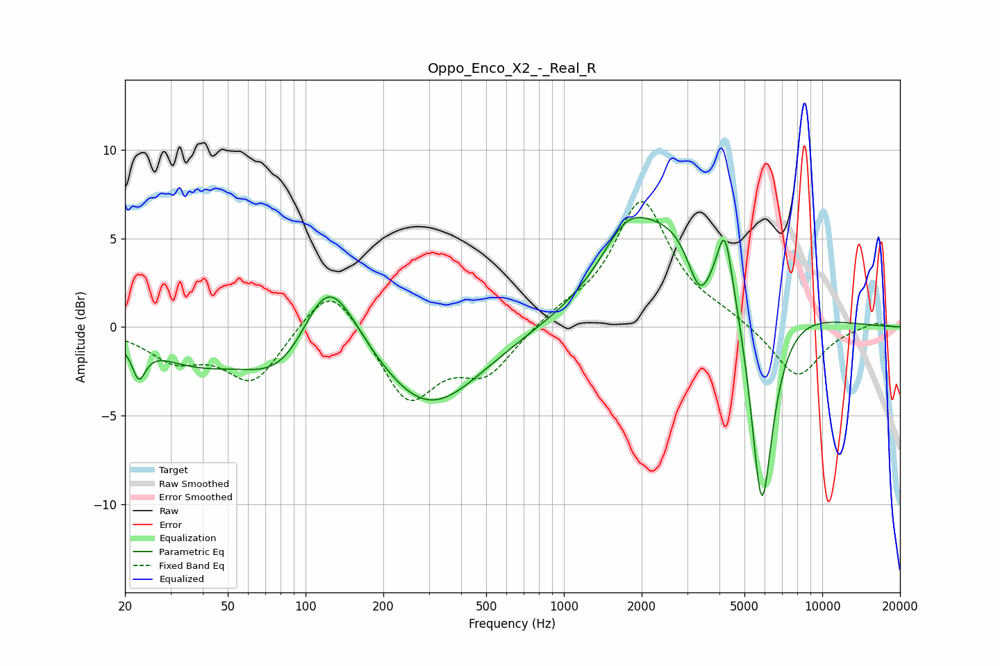

# Oppo_Enco_X2_-_Real_R
See [usage instructions](https://github.com/jaakkopasanen/AutoEq#usage) for more options and info.

### Parametric EQs
Apply preamp of -6.3 dB when using parametric equalizer.

|   # | Type    |   Fc (Hz) |    Q |   Gain (dB) |
|-----|---------|-----------|------|-------------|
|   1 | Peaking |        23 | 5.61 |        -1.8 |
|   2 | Peaking |        37 | 0.85 |        -1.6 |
|   3 | Peaking |        86 | 0.9  |        -3.6 |
|   4 | Peaking |       121 | 1.22 |         6   |
|   5 | Peaking |       299 | 0.7  |        -4.7 |
|   6 | Peaking |      1745 | 1.44 |         2.8 |
|   7 | Peaking |      3214 | 0.63 |         6.6 |
|   8 | Peaking |      3363 | 2.69 |        -3.9 |
|   9 | Peaking |      4201 | 5.04 |         3.3 |
|  10 | Peaking |      5830 | 2.85 |       -13.3 |

### Fixed Band EQs
When using fixed band (also called graphic) equalizer, apply preamp of **-7.2 dB** (if available) and set gains manually with these parameters.

|   # | Type    |   Fc (Hz) |    Q |   Gain (dB) |
|-----|---------|-----------|------|-------------|
|   1 | Peaking |        31 | 1.41 |        -1.7 |
|   2 | Peaking |        62 | 1.41 |        -3.1 |
|   3 | Peaking |       125 | 1.41 |         2.9 |
|   4 | Peaking |       250 | 1.41 |        -4.2 |
|   5 | Peaking |       500 | 1.41 |        -2.5 |
|   6 | Peaking |      1000 | 1.41 |         0.7 |
|   7 | Peaking |      2000 | 1.41 |         7.1 |
|   8 | Peaking |      4000 | 1.41 |         0.5 |
|   9 | Peaking |      8000 | 1.41 |        -2.9 |
|  10 | Peaking |     16000 | 1.41 |         0.3 |

### Graphs

