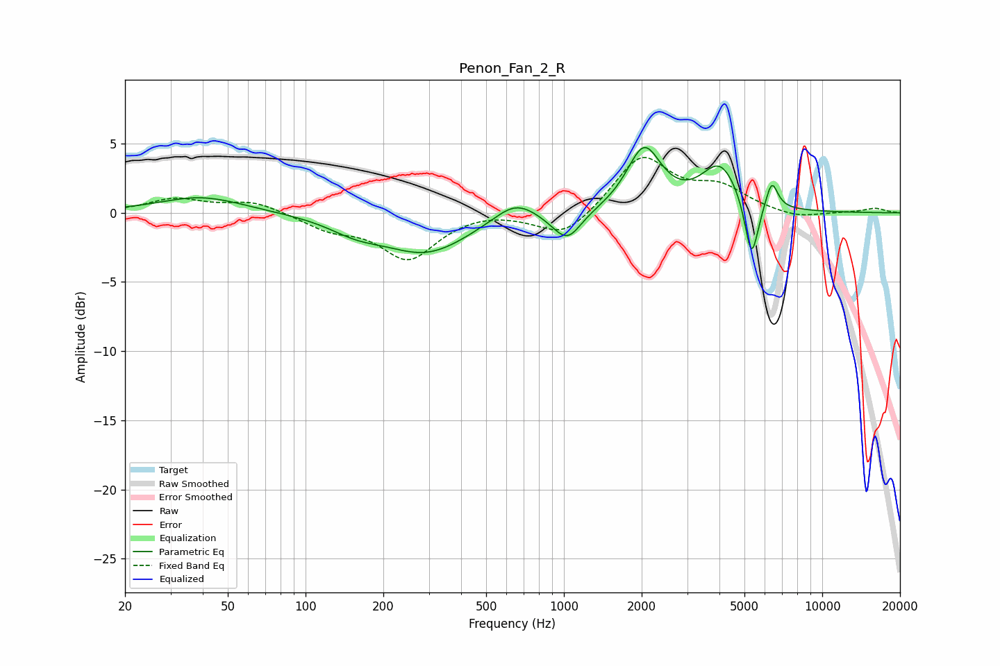

# Penon_Fan_2_R
See [usage instructions](https://github.com/jaakkopasanen/AutoEq#usage) for more options and info.

### Parametric EQs
Apply preamp of -4.8 dB when using parametric equalizer.

|   # | Type    |   Fc (Hz) |    Q |   Gain (dB) |
|-----|---------|-----------|------|-------------|
|   1 | Peaking |        40 | 0.87 |         1.2 |
|   2 | Peaking |       156 | 1.37 |        -0.9 |
|   3 | Peaking |       294 | 0.84 |        -2.8 |
|   4 | Peaking |       649 | 1.7  |         1.5 |
|   5 | Peaking |       970 | 2.07 |        -0.5 |
|   6 | Peaking |      1037 | 2.7  |        -1.7 |
|   7 | Peaking |      2043 | 2.14 |         4.5 |
|   8 | Peaking |      4024 | 1.92 |         3.3 |
|   9 | Peaking |      5326 | 5.38 |        -4.5 |
|  10 | Peaking |      6382 | 6    |         2   |

### Fixed Band EQs
When using fixed band (also called graphic) equalizer, apply preamp of **-4.1 dB** (if available) and set gains manually with these parameters.

|   # | Type    |   Fc (Hz) |    Q |   Gain (dB) |
|-----|---------|-----------|------|-------------|
|   1 | Peaking |        31 | 1.41 |         1   |
|   2 | Peaking |        62 | 1.41 |         0.8 |
|   3 | Peaking |       125 | 1.41 |        -1   |
|   4 | Peaking |       250 | 1.41 |        -3.2 |
|   5 | Peaking |       500 | 1.41 |         0.2 |
|   6 | Peaking |      1000 | 1.41 |        -1.9 |
|   7 | Peaking |      2000 | 1.41 |         4.1 |
|   8 | Peaking |      4000 | 1.41 |         1.6 |
|   9 | Peaking |      8000 | 1.41 |        -0.5 |
|  10 | Peaking |     16000 | 1.41 |         0.3 |

### Graphs

