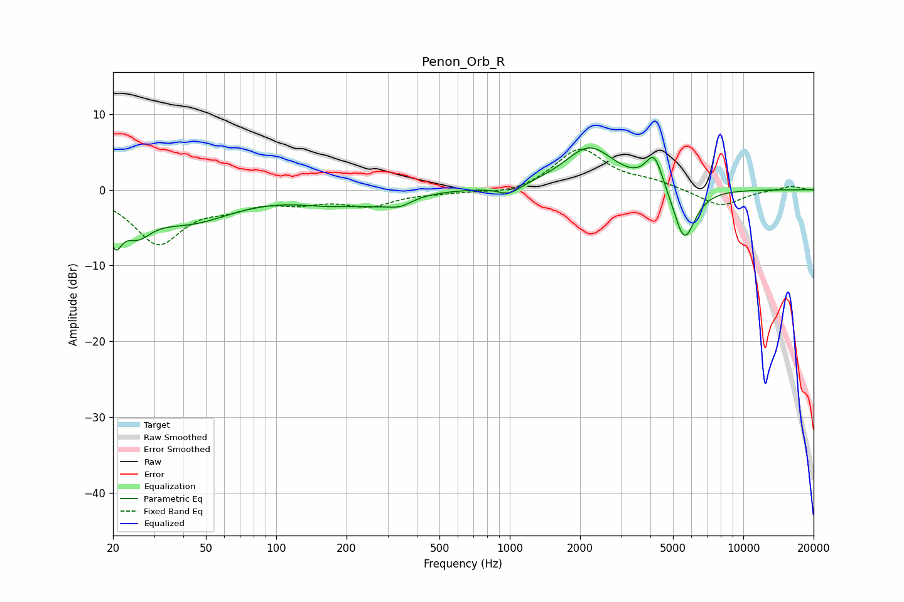

# Penon_Orb_R
See [usage instructions](https://github.com/jaakkopasanen/AutoEq#usage) for more options and info.

### Parametric EQs
Apply preamp of -5.6 dB when using parametric equalizer.

|   # | Type    |   Fc (Hz) |    Q |   Gain (dB) |
|-----|---------|-----------|------|-------------|
|   1 | Peaking |        20 | 5.02 |        -4.6 |
|   2 | Peaking |        25 | 2.33 |        -3.4 |
|   3 | Peaking |        42 | 0.75 |        -3.9 |
|   4 | Peaking |       172 | 0.95 |        -1.4 |
|   5 | Peaking |       263 | 1.62 |        -0.8 |
|   6 | Peaking |       338 | 2.52 |        -1.2 |
|   7 | Peaking |       993 | 2.99 |        -1.2 |
|   8 | Peaking |      2195 | 1.29 |         5.6 |
|   9 | Peaking |      4160 | 3.72 |         4.5 |
|  10 | Peaking |      5590 | 2.94 |        -7.3 |

### Fixed Band EQs
When using fixed band (also called graphic) equalizer, apply preamp of **-5.5 dB** (if available) and set gains manually with these parameters.

|   # | Type    |   Fc (Hz) |    Q |   Gain (dB) |
|-----|---------|-----------|------|-------------|
|   1 | Peaking |        31 | 1.41 |        -6.9 |
|   2 | Peaking |        62 | 1.41 |        -1.6 |
|   3 | Peaking |       125 | 1.41 |        -1.3 |
|   4 | Peaking |       250 | 1.41 |        -1.9 |
|   5 | Peaking |       500 | 1.41 |        -0.3 |
|   6 | Peaking |      1000 | 1.41 |        -0.7 |
|   7 | Peaking |      2000 | 1.41 |         5.4 |
|   8 | Peaking |      4000 | 1.41 |         0.9 |
|   9 | Peaking |      8000 | 1.41 |        -2.3 |
|  10 | Peaking |     16000 | 1.41 |         0.5 |

### Graphs

