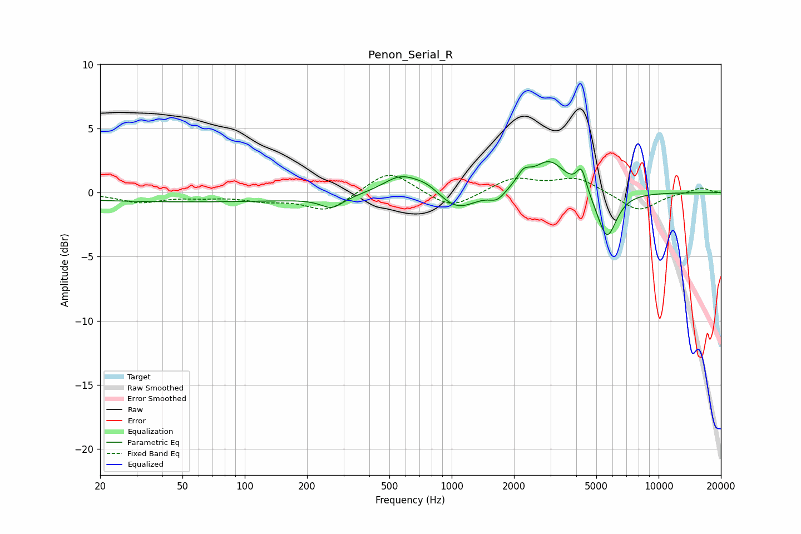

# Penon_Serial_R
See [usage instructions](https://github.com/jaakkopasanen/AutoEq#usage) for more options and info.

### Parametric EQs
Apply preamp of -2.5 dB when using parametric equalizer.

|   # | Type    |   Fc (Hz) |    Q |   Gain (dB) |
|-----|---------|-----------|------|-------------|
|   1 | Peaking |        54 | 0.18 |        -0.7 |
|   2 | Peaking |       264 | 2.59 |        -0.9 |
|   3 | Peaking |       566 | 1.61 |         1.4 |
|   4 | Peaking |       763 | 2.09 |         0.7 |
|   5 | Peaking |      1058 | 1.55 |        -1.5 |
|   6 | Peaking |      1659 | 3.85 |        -0.7 |
|   7 | Peaking |      2227 | 4.2  |         1   |
|   8 | Peaking |      2969 | 1.78 |         2.5 |
|   9 | Peaking |      4241 | 6    |         1.8 |
|  10 | Peaking |      5625 | 2.96 |        -3.7 |

### Fixed Band EQs
When using fixed band (also called graphic) equalizer, apply preamp of **-1.4 dB** (if available) and set gains manually with these parameters.

|   # | Type    |   Fc (Hz) |    Q |   Gain (dB) |
|-----|---------|-----------|------|-------------|
|   1 | Peaking |        31 | 1.41 |        -0.7 |
|   2 | Peaking |        62 | 1.41 |        -0.3 |
|   3 | Peaking |       125 | 1.41 |        -0.5 |
|   4 | Peaking |       250 | 1.41 |        -1.4 |
|   5 | Peaking |       500 | 1.41 |         1.8 |
|   6 | Peaking |      1000 | 1.41 |        -1.3 |
|   7 | Peaking |      2000 | 1.41 |         1.1 |
|   8 | Peaking |      4000 | 1.41 |         1.1 |
|   9 | Peaking |      8000 | 1.41 |        -1.5 |
|  10 | Peaking |     16000 | 1.41 |         0.4 |

### Graphs

