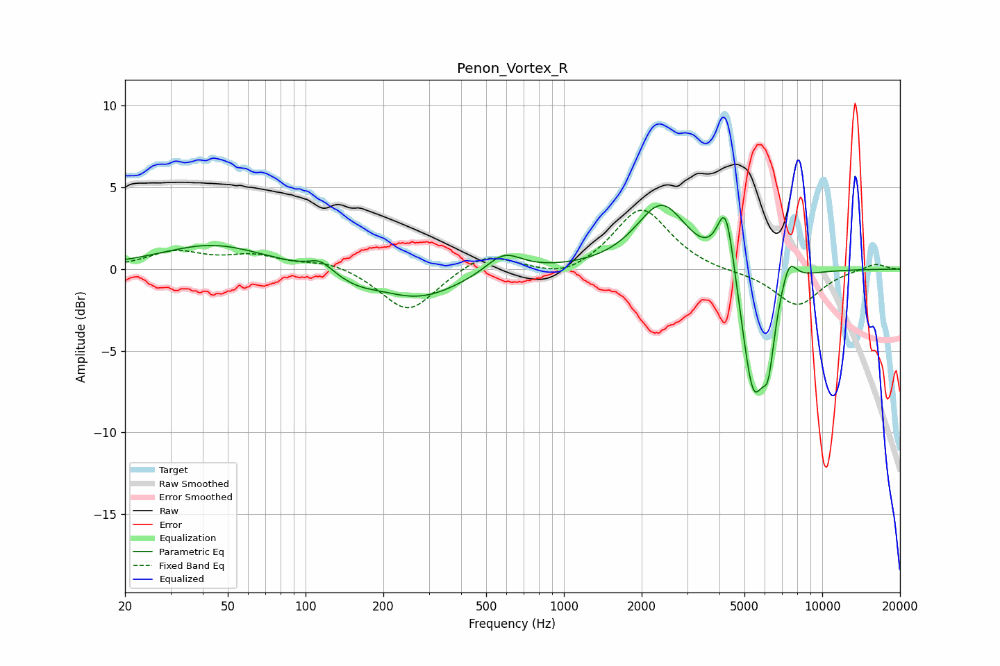

# Penon_Vortex_R
See [usage instructions](https://github.com/jaakkopasanen/AutoEq#usage) for more options and info.

### Parametric EQs
Apply preamp of -4.0 dB when using parametric equalizer.

|   # | Type    |   Fc (Hz) |    Q |   Gain (dB) |
|-----|---------|-----------|------|-------------|
|   1 | Peaking |        44 | 0.71 |         1.5 |
|   2 | Peaking |       114 | 3.25 |         0.7 |
|   3 | Peaking |       158 | 1.81 |        -0.5 |
|   4 | Peaking |       274 | 0.87 |        -1.8 |
|   5 | Peaking |       585 | 2.05 |         1.3 |
|   6 | Peaking |      2393 | 1.44 |         4   |
|   7 | Peaking |      4239 | 4.09 |         4.6 |
|   8 | Peaking |      5413 | 2.89 |        -8   |
|   9 | Peaking |      6187 | 5.99 |        -3.2 |
|  10 | Peaking |      7439 | 4.61 |         1.6 |

### Fixed Band EQs
When using fixed band (also called graphic) equalizer, apply preamp of **-3.7 dB** (if available) and set gains manually with these parameters.

|   # | Type    |   Fc (Hz) |    Q |   Gain (dB) |
|-----|---------|-----------|------|-------------|
|   1 | Peaking |        31 | 1.41 |         1   |
|   2 | Peaking |        62 | 1.41 |         0.7 |
|   3 | Peaking |       125 | 1.41 |         0.5 |
|   4 | Peaking |       250 | 1.41 |        -2.7 |
|   5 | Peaking |       500 | 1.41 |         1.1 |
|   6 | Peaking |      1000 | 1.41 |        -0.7 |
|   7 | Peaking |      2000 | 1.41 |         3.8 |
|   8 | Peaking |      4000 | 1.41 |        -0.2 |
|   9 | Peaking |      8000 | 1.41 |        -2.3 |
|  10 | Peaking |     16000 | 1.41 |         0.4 |

### Graphs

