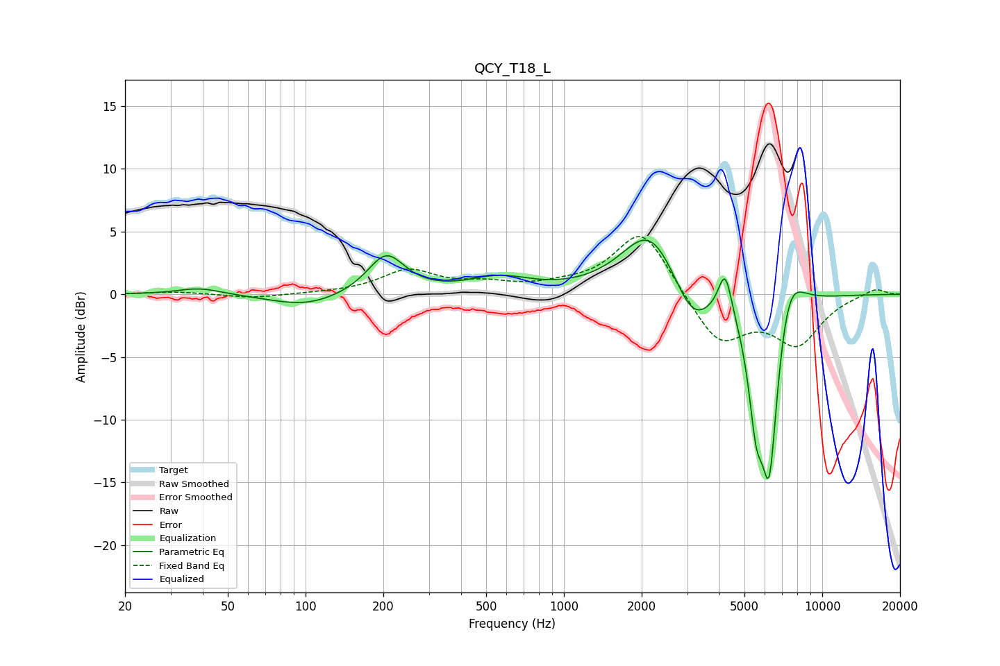

# QCY_T18_L
See [usage instructions](https://github.com/jaakkopasanen/AutoEq#usage) for more options and info.

### Parametric EQs
Apply preamp of -4.4 dB when using parametric equalizer.

|   # | Type    |   Fc (Hz) |    Q |   Gain (dB) |
|-----|---------|-----------|------|-------------|
|   1 | Peaking |        39 | 1.65 |         0.6 |
|   2 | Peaking |       100 | 1.04 |        -1   |
|   3 | Peaking |       205 | 1.96 |         3.2 |
|   4 | Peaking |       562 | 1.18 |         1.2 |
|   5 | Peaking |      2156 | 1.28 |         5.3 |
|   6 | Peaking |      3137 | 1.95 |        -3.3 |
|   7 | Peaking |      4210 | 5.32 |         3.6 |
|   8 | Peaking |      5541 | 5.08 |        -5.7 |
|   9 | Peaking |      6242 | 3.37 |       -15.7 |
|  10 | Peaking |      7335 | 2.28 |         5.1 |

### Fixed Band EQs
When using fixed band (also called graphic) equalizer, apply preamp of **-4.7 dB** (if available) and set gains manually with these parameters.

|   # | Type    |   Fc (Hz) |    Q |   Gain (dB) |
|-----|---------|-----------|------|-------------|
|   1 | Peaking |        31 | 1.41 |         0.2 |
|   2 | Peaking |        62 | 1.41 |        -0.3 |
|   3 | Peaking |       125 | 1.41 |         0.1 |
|   4 | Peaking |       250 | 1.41 |         1.8 |
|   5 | Peaking |       500 | 1.41 |         0.7 |
|   6 | Peaking |      1000 | 1.41 |         0.4 |
|   7 | Peaking |      2000 | 1.41 |         5.3 |
|   8 | Peaking |      4000 | 1.41 |        -4   |
|   9 | Peaking |      8000 | 1.41 |        -3.8 |
|  10 | Peaking |     16000 | 1.41 |         0.6 |

### Graphs

