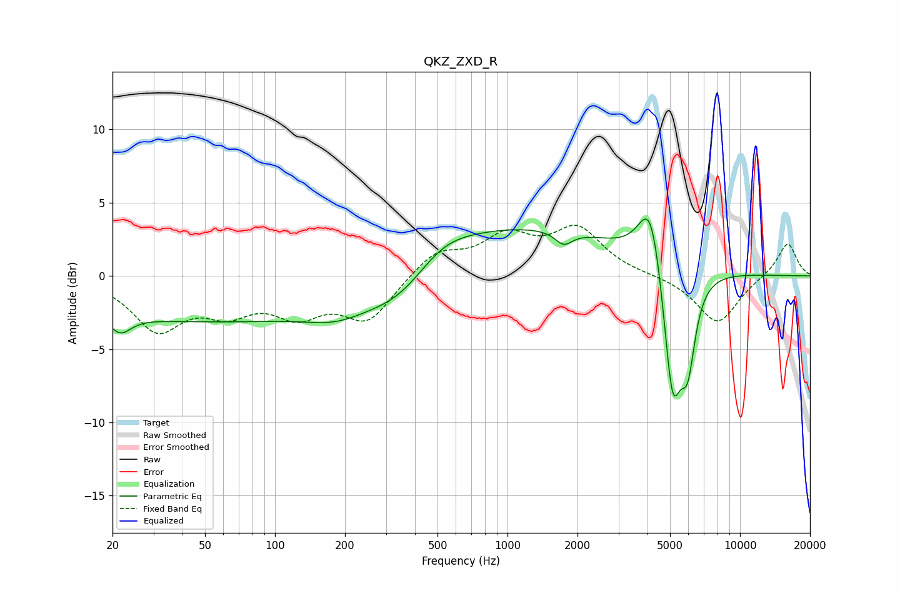

# QKZ_ZXD_R
See [usage instructions](https://github.com/jaakkopasanen/AutoEq#usage) for more options and info.

### Parametric EQs
Apply preamp of -4.0 dB when using parametric equalizer.

|   # | Type    |   Fc (Hz) |    Q |   Gain (dB) |
|-----|---------|-----------|------|-------------|
|   1 | Peaking |        22 | 3.01 |        -1.3 |
|   2 | Peaking |        60 | 0.18 |        -3.1 |
|   3 | Peaking |       185 | 1.04 |        -1.1 |
|   4 | Peaking |       351 | 0.85 |        -2.7 |
|   5 | Peaking |       513 | 1.11 |         1.4 |
|   6 | Peaking |       924 | 0.25 |         3.6 |
|   7 | Peaking |      1746 | 3.81 |        -0.9 |
|   8 | Peaking |      4133 | 2.71 |         5   |
|   9 | Peaking |      5121 | 3.44 |        -9.4 |
|  10 | Peaking |      5964 | 4.27 |        -5   |

### Fixed Band EQs
When using fixed band (also called graphic) equalizer, apply preamp of **-3.6 dB** (if available) and set gains manually with these parameters.

|   # | Type    |   Fc (Hz) |    Q |   Gain (dB) |
|-----|---------|-----------|------|-------------|
|   1 | Peaking |        31 | 1.41 |        -3.5 |
|   2 | Peaking |        62 | 1.41 |        -2   |
|   3 | Peaking |       125 | 1.41 |        -2.2 |
|   4 | Peaking |       250 | 1.41 |        -2.9 |
|   5 | Peaking |       500 | 1.41 |         1.7 |
|   6 | Peaking |      1000 | 1.41 |         2.4 |
|   7 | Peaking |      2000 | 1.41 |         3   |
|   8 | Peaking |      4000 | 1.41 |         0   |
|   9 | Peaking |      8000 | 1.41 |        -3.3 |
|  10 | Peaking |     16000 | 1.41 |         2.3 |

### Graphs

