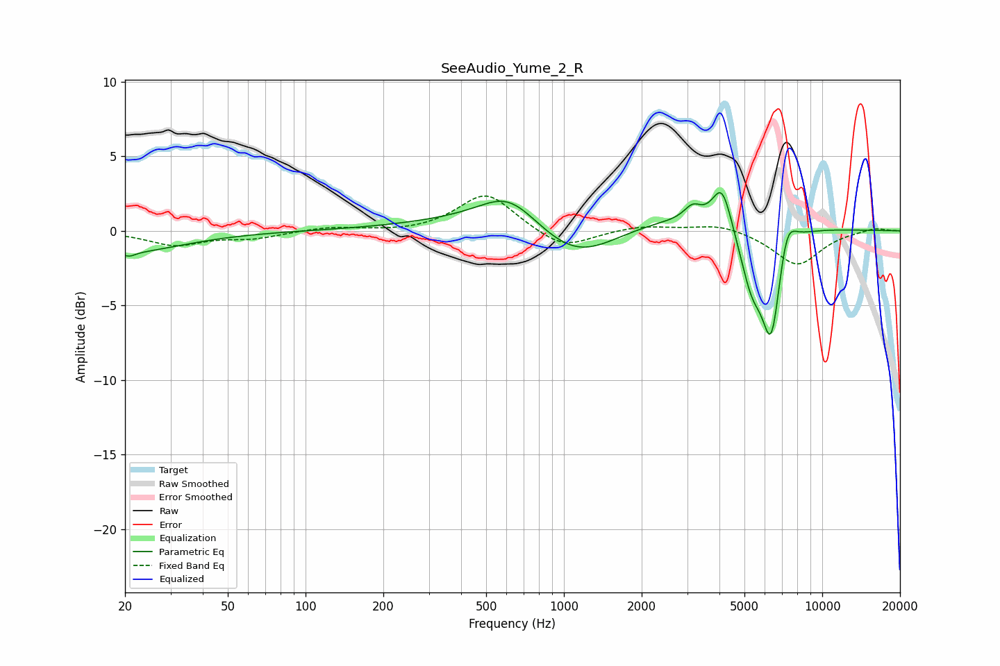

# SeeAudio_Yume_2_R
See [usage instructions](https://github.com/jaakkopasanen/AutoEq#usage) for more options and info.

### Parametric EQs
Apply preamp of -2.7 dB when using parametric equalizer.

|   # | Type    |   Fc (Hz) |    Q |   Gain (dB) |
|-----|---------|-----------|------|-------------|
|   1 | Peaking |        20 | 0.66 |        -1.4 |
|   2 | Peaking |        21 | 5.84 |        -0.3 |
|   3 | Peaking |       611 | 1.26 |         2.1 |
|   4 | Peaking |      1120 | 0.83 |        -3.1 |
|   5 | Peaking |      1448 | 0.23 |         1.5 |
|   6 | Peaking |      3148 | 4.28 |         0.9 |
|   7 | Peaking |      4094 | 3.76 |         2.9 |
|   8 | Peaking |      5337 | 2.95 |        -3.7 |
|   9 | Peaking |      6356 | 3.68 |        -7   |
|  10 | Peaking |      7289 | 3.99 |         2.2 |

### Fixed Band EQs
When using fixed band (also called graphic) equalizer, apply preamp of **-2.4 dB** (if available) and set gains manually with these parameters.

|   # | Type    |   Fc (Hz) |    Q |   Gain (dB) |
|-----|---------|-----------|------|-------------|
|   1 | Peaking |        31 | 1.41 |        -0.9 |
|   2 | Peaking |        62 | 1.41 |        -0.4 |
|   3 | Peaking |       125 | 1.41 |         0.3 |
|   4 | Peaking |       250 | 1.41 |        -0.1 |
|   5 | Peaking |       500 | 1.41 |         2.6 |
|   6 | Peaking |      1000 | 1.41 |        -1.3 |
|   7 | Peaking |      2000 | 1.41 |         0.4 |
|   8 | Peaking |      4000 | 1.41 |         0.5 |
|   9 | Peaking |      8000 | 1.41 |        -2.3 |
|  10 | Peaking |     16000 | 1.41 |         0.2 |

### Graphs

