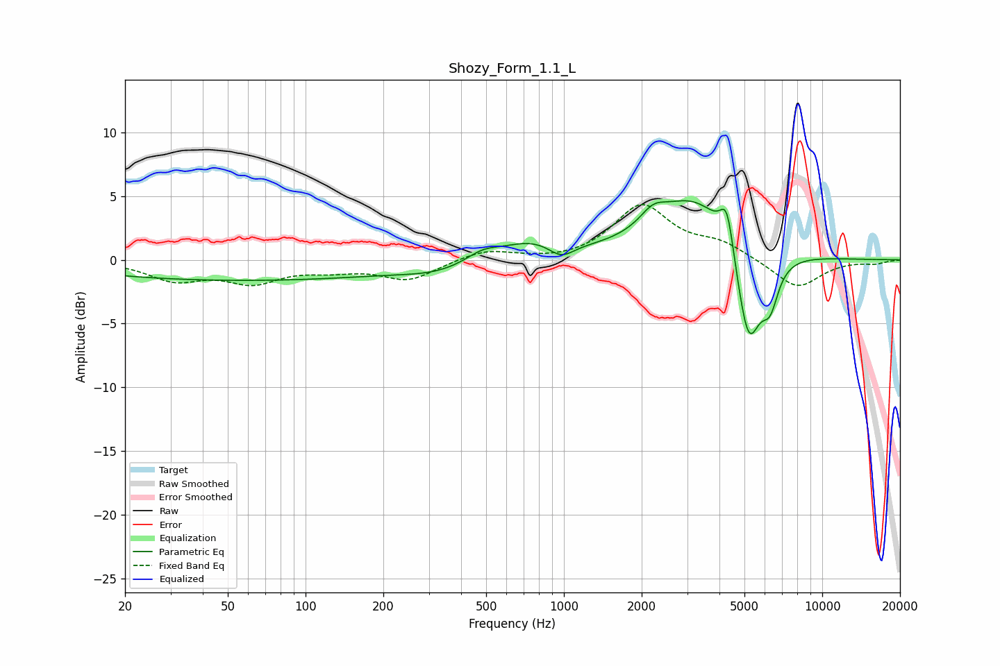

# Shozy_Form_1.1_L
See [usage instructions](https://github.com/jaakkopasanen/AutoEq#usage) for more options and info.

### Parametric EQs
Apply preamp of -4.7 dB when using parametric equalizer.

|   # | Type    |   Fc (Hz) |    Q |   Gain (dB) |
|-----|---------|-----------|------|-------------|
|   1 | Peaking |        56 | 0.22 |        -1.6 |
|   2 | Peaking |       325 | 1.03 |        -0.7 |
|   3 | Peaking |       484 | 2.25 |         0.7 |
|   4 | Peaking |       749 | 1.08 |         1.4 |
|   5 | Peaking |       977 | 2.79 |        -1.1 |
|   6 | Peaking |      2212 | 2.78 |         1.3 |
|   7 | Peaking |      3242 | 0.9  |         5   |
|   8 | Peaking |      4279 | 5.32 |         3.4 |
|   9 | Peaking |      5179 | 2.78 |        -8.3 |
|  10 | Peaking |      6285 | 4.3  |        -2.9 |

### Fixed Band EQs
When using fixed band (also called graphic) equalizer, apply preamp of **-4.4 dB** (if available) and set gains manually with these parameters.

|   # | Type    |   Fc (Hz) |    Q |   Gain (dB) |
|-----|---------|-----------|------|-------------|
|   1 | Peaking |        31 | 1.41 |        -1.5 |
|   2 | Peaking |        62 | 1.41 |        -1.6 |
|   3 | Peaking |       125 | 1.41 |        -0.6 |
|   4 | Peaking |       250 | 1.41 |        -1.5 |
|   5 | Peaking |       500 | 1.41 |         0.8 |
|   6 | Peaking |      1000 | 1.41 |        -0.2 |
|   7 | Peaking |      2000 | 1.41 |         4.2 |
|   8 | Peaking |      4000 | 1.41 |         1.2 |
|   9 | Peaking |      8000 | 1.41 |        -2.3 |
|  10 | Peaking |     16000 | 1.41 |        -0.3 |

### Graphs

