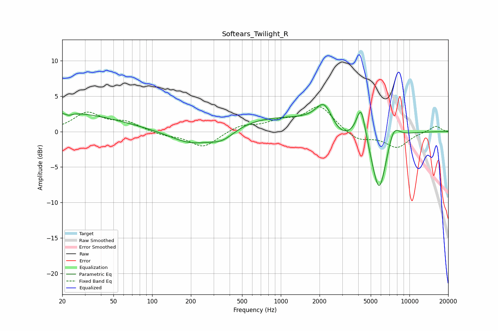

# Softears_Twilight_R
See [usage instructions](https://github.com/jaakkopasanen/AutoEq#usage) for more options and info.

### Parametric EQs
Apply preamp of -3.9 dB when using parametric equalizer.

|   # | Type    |   Fc (Hz) |    Q |   Gain (dB) |
|-----|---------|-----------|------|-------------|
|   1 | Peaking |        20 | 0.33 |         2.7 |
|   2 | Peaking |        22 | 5.93 |        -0.3 |
|   3 | Peaking |       203 | 0.82 |        -2.4 |
|   4 | Peaking |       351 | 1.34 |        -1.8 |
|   5 | Peaking |       905 | 0.23 |         2.3 |
|   6 | Peaking |      2180 | 2.19 |         3.5 |
|   7 | Peaking |      2883 | 1.29 |        -2.2 |
|   8 | Peaking |      4206 | 3.84 |         4.9 |
|   9 | Peaking |      5808 | 2.24 |        -9.3 |
|  10 | Peaking |      7495 | 2.73 |         2.7 |

### Fixed Band EQs
When using fixed band (also called graphic) equalizer, apply preamp of **-3.6 dB** (if available) and set gains manually with these parameters.

|   # | Type    |   Fc (Hz) |    Q |   Gain (dB) |
|-----|---------|-----------|------|-------------|
|   1 | Peaking |        31 | 1.41 |         2.6 |
|   2 | Peaking |        62 | 1.41 |         1.2 |
|   3 | Peaking |       125 | 1.41 |        -0.5 |
|   4 | Peaking |       250 | 1.41 |        -2.2 |
|   5 | Peaking |       500 | 1.41 |         0.9 |
|   6 | Peaking |      1000 | 1.41 |         1.2 |
|   7 | Peaking |      2000 | 1.41 |         3.5 |
|   8 | Peaking |      4000 | 1.41 |        -1.3 |
|   9 | Peaking |      8000 | 1.41 |        -2.2 |
|  10 | Peaking |     16000 | 1.41 |         0.8 |

### Graphs

