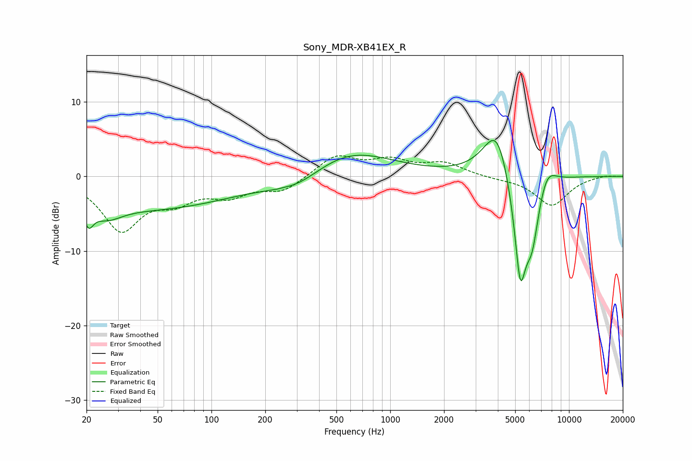

# Sony_MDR-XB41EX_R
See [usage instructions](https://github.com/jaakkopasanen/AutoEq#usage) for more options and info.

### Parametric EQs
Apply preamp of -4.9 dB when using parametric equalizer.

|   # | Type    |   Fc (Hz) |    Q |   Gain (dB) |
|-----|---------|-----------|------|-------------|
|   1 | Peaking |        21 | 5.52 |        -2.5 |
|   2 | Peaking |        26 | 1.68 |        -1.9 |
|   3 | Peaking |        46 | 0.3  |        -4.2 |
|   4 | Peaking |       257 | 5.77 |         0.1 |
|   5 | Peaking |       300 | 0.9  |        -2.3 |
|   6 | Peaking |       570 | 0.58 |         3.8 |
|   7 | Peaking |      3961 | 1.8  |         7.5 |
|   8 | Peaking |      5342 | 3.53 |       -14.8 |
|   9 | Peaking |      6219 | 3.51 |        -6.7 |
|  10 | Peaking |      7519 | 2.74 |         2.5 |

### Fixed Band EQs
When using fixed band (also called graphic) equalizer, apply preamp of **-2.9 dB** (if available) and set gains manually with these parameters.

|   # | Type    |   Fc (Hz) |    Q |   Gain (dB) |
|-----|---------|-----------|------|-------------|
|   1 | Peaking |        31 | 1.41 |        -6.9 |
|   2 | Peaking |        62 | 1.41 |        -2.6 |
|   3 | Peaking |       125 | 1.41 |        -2.2 |
|   4 | Peaking |       250 | 1.41 |        -1.9 |
|   5 | Peaking |       500 | 1.41 |         2.8 |
|   6 | Peaking |      1000 | 1.41 |         1.9 |
|   7 | Peaking |      2000 | 1.41 |         1.7 |
|   8 | Peaking |      4000 | 1.41 |        -0.2 |
|   9 | Peaking |      8000 | 1.41 |        -3.9 |
|  10 | Peaking |     16000 | 1.41 |         0.2 |

### Graphs

