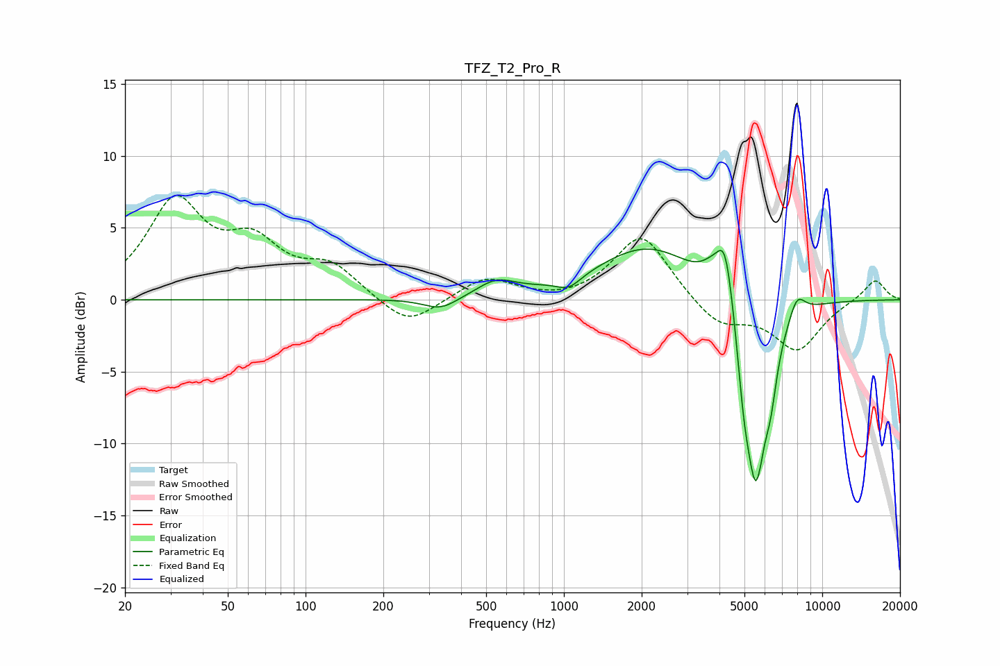

# TFZ_T2_Pro_R
See [usage instructions](https://github.com/jaakkopasanen/AutoEq#usage) for more options and info.

### Parametric EQs
Apply preamp of -3.6 dB when using parametric equalizer.

|   # | Type    |   Fc (Hz) |    Q |   Gain (dB) |
|-----|---------|-----------|------|-------------|
|   1 | Peaking |       334 | 2.12 |        -0.9 |
|   2 | Peaking |       547 | 1.89 |         1.1 |
|   3 | Peaking |      1045 | 2.94 |        -0.8 |
|   4 | Peaking |      2133 | 0.71 |         3.7 |
|   5 | Peaking |      3724 | 3.23 |         1   |
|   6 | Peaking |      4219 | 4.08 |         4.7 |
|   7 | Peaking |      4970 | 6    |        -2.6 |
|   8 | Peaking |      5526 | 2.98 |       -13.1 |
|   9 | Peaking |      6323 | 6    |        -2.3 |
|  10 | Peaking |      7976 | 4.13 |         1.6 |

### Fixed Band EQs
When using fixed band (also called graphic) equalizer, apply preamp of **-7.4 dB** (if available) and set gains manually with these parameters.

|   # | Type    |   Fc (Hz) |    Q |   Gain (dB) |
|-----|---------|-----------|------|-------------|
|   1 | Peaking |        31 | 1.41 |         6.6 |
|   2 | Peaking |        62 | 1.41 |         3.3 |
|   3 | Peaking |       125 | 1.41 |         2.1 |
|   4 | Peaking |       250 | 1.41 |        -2   |
|   5 | Peaking |       500 | 1.41 |         1.6 |
|   6 | Peaking |      1000 | 1.41 |        -0.2 |
|   7 | Peaking |      2000 | 1.41 |         4.6 |
|   8 | Peaking |      4000 | 1.41 |        -1.9 |
|   9 | Peaking |      8000 | 1.41 |        -3.4 |
|  10 | Peaking |     16000 | 1.41 |         1.5 |

### Graphs

