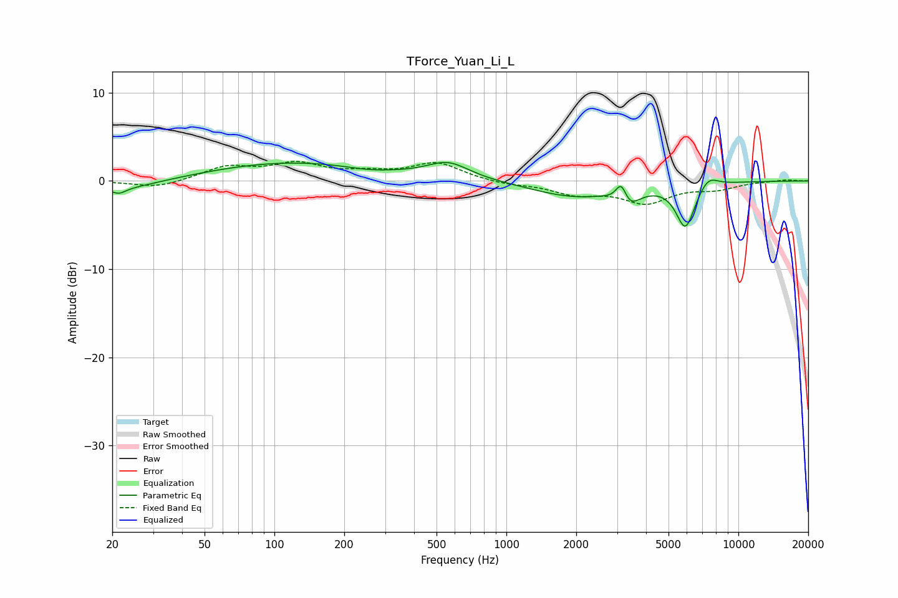

# TForce_Yuan_Li_L
See [usage instructions](https://github.com/jaakkopasanen/AutoEq#usage) for more options and info.

### Parametric EQs
Apply preamp of -2.2 dB when using parametric equalizer.

|   # | Type    |   Fc (Hz) |    Q |   Gain (dB) |
|-----|---------|-----------|------|-------------|
|   1 | Peaking |        20 | 0.78 |        -1.3 |
|   2 | Peaking |        21 | 5.35 |        -0.5 |
|   3 | Peaking |       117 | 0.4  |         2.1 |
|   4 | Peaking |       254 | 1.58 |        -0.3 |
|   5 | Peaking |       561 | 1.54 |         1.9 |
|   6 | Peaking |      1937 | 0.79 |        -1.7 |
|   7 | Peaking |      3131 | 5.98 |         2.5 |
|   8 | Peaking |      3324 | 3.04 |        -2.3 |
|   9 | Peaking |      5914 | 3.38 |        -5.1 |
|  10 | Peaking |      7419 | 3.27 |         1.3 |

### Fixed Band EQs
When using fixed band (also called graphic) equalizer, apply preamp of **-2.3 dB** (if available) and set gains manually with these parameters.

|   # | Type    |   Fc (Hz) |    Q |   Gain (dB) |
|-----|---------|-----------|------|-------------|
|   1 | Peaking |        31 | 1.41 |        -0.8 |
|   2 | Peaking |        62 | 1.41 |         1.5 |
|   3 | Peaking |       125 | 1.41 |         1.8 |
|   4 | Peaking |       250 | 1.41 |         0.7 |
|   5 | Peaking |       500 | 1.41 |         2   |
|   6 | Peaking |      1000 | 1.41 |        -0.4 |
|   7 | Peaking |      2000 | 1.41 |        -1.3 |
|   8 | Peaking |      4000 | 1.41 |        -2.3 |
|   9 | Peaking |      8000 | 1.41 |        -0.8 |
|  10 | Peaking |     16000 | 1.41 |         0.2 |

### Graphs

