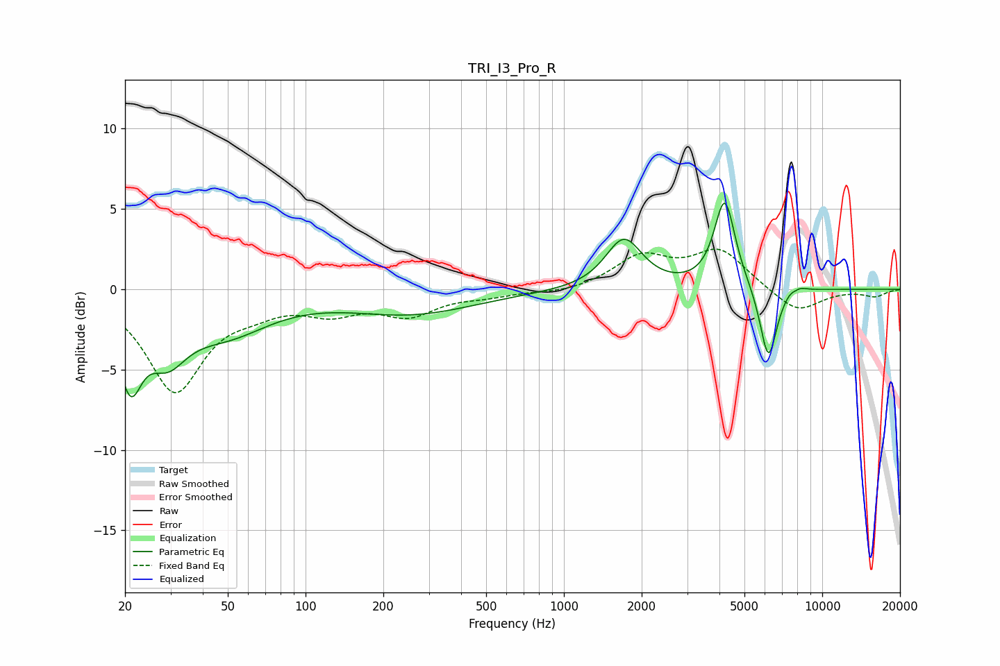

# TRI_I3_Pro_R
See [usage instructions](https://github.com/jaakkopasanen/AutoEq#usage) for more options and info.

### Parametric EQs
Apply preamp of -5.5 dB when using parametric equalizer.

|   # | Type    |   Fc (Hz) |    Q |   Gain (dB) |
|-----|---------|-----------|------|-------------|
|   1 | Peaking |        20 | 5.62 |        -0.6 |
|   2 | Peaking |        21 | 3.3  |        -4.2 |
|   3 | Peaking |        29 | 1.82 |        -3   |
|   4 | Peaking |        49 | 0.82 |        -2.4 |
|   5 | Peaking |       257 | 0.56 |        -1.5 |
|   6 | Peaking |      1707 | 2.01 |         3.1 |
|   7 | Peaking |      4194 | 3.5  |         5.5 |
|   8 | Peaking |      6189 | 4.18 |        -4.6 |
|   9 | Peaking |      7838 | 4.9  |         1.5 |
|  10 | Peaking |      7849 | 6    |        -1.2 |

### Fixed Band EQs
When using fixed band (also called graphic) equalizer, apply preamp of **-2.6 dB** (if available) and set gains manually with these parameters.

|   # | Type    |   Fc (Hz) |    Q |   Gain (dB) |
|-----|---------|-----------|------|-------------|
|   1 | Peaking |        31 | 1.41 |        -6.2 |
|   2 | Peaking |        62 | 1.41 |        -0.8 |
|   3 | Peaking |       125 | 1.41 |        -1.2 |
|   4 | Peaking |       250 | 1.41 |        -1.5 |
|   5 | Peaking |       500 | 1.41 |        -0.3 |
|   6 | Peaking |      1000 | 1.41 |        -0.3 |
|   7 | Peaking |      2000 | 1.41 |         1.9 |
|   8 | Peaking |      4000 | 1.41 |         2.4 |
|   9 | Peaking |      8000 | 1.41 |        -1.5 |
|  10 | Peaking |     16000 | 1.41 |        -0.4 |

### Graphs

