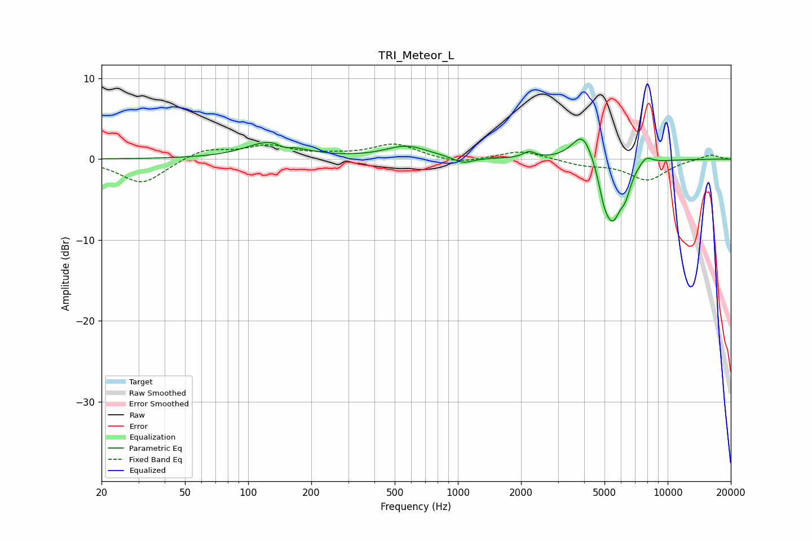

# TRI_Meteor_L
See [usage instructions](https://github.com/jaakkopasanen/AutoEq#usage) for more options and info.

### Parametric EQs
Apply preamp of -2.6 dB when using parametric equalizer.

|   # | Type    |   Fc (Hz) |    Q |   Gain (dB) |
|-----|---------|-----------|------|-------------|
|   1 | Peaking |       130 | 1.22 |         2.2 |
|   2 | Peaking |       148 | 4.34 |        -0.6 |
|   3 | Peaking |       571 | 1.4  |         1.5 |
|   4 | Peaking |      1058 | 3.05 |        -0.8 |
|   5 | Peaking |      2185 | 4.9  |         0.8 |
|   6 | Peaking |      3952 | 2.66 |         4   |
|   7 | Peaking |      4963 | 6    |        -1.8 |
|   8 | Peaking |      5449 | 3.02 |        -7.4 |
|   9 | Peaking |      6295 | 5.46 |        -2   |
|  10 | Peaking |      7865 | 4.23 |         1.1 |

### Fixed Band EQs
When using fixed band (also called graphic) equalizer, apply preamp of **-2.0 dB** (if available) and set gains manually with these parameters.

|   # | Type    |   Fc (Hz) |    Q |   Gain (dB) |
|-----|---------|-----------|------|-------------|
|   1 | Peaking |        31 | 1.41 |        -3.1 |
|   2 | Peaking |        62 | 1.41 |         1.3 |
|   3 | Peaking |       125 | 1.41 |         1.5 |
|   4 | Peaking |       250 | 1.41 |         0.4 |
|   5 | Peaking |       500 | 1.41 |         1.8 |
|   6 | Peaking |      1000 | 1.41 |        -0.7 |
|   7 | Peaking |      2000 | 1.41 |         1.1 |
|   8 | Peaking |      4000 | 1.41 |        -0.7 |
|   9 | Peaking |      8000 | 1.41 |        -2.6 |
|  10 | Peaking |     16000 | 1.41 |         0.6 |

### Graphs

