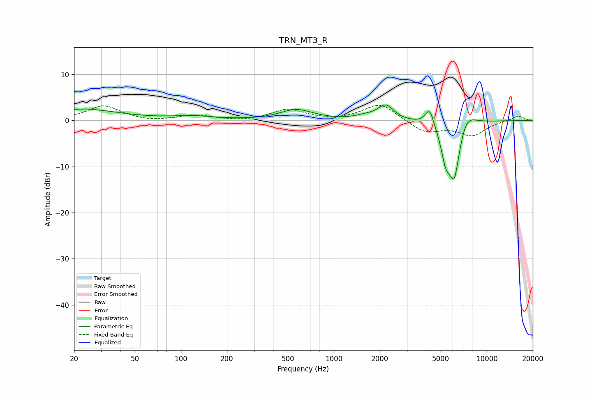

# TRN_MT3_R
See [usage instructions](https://github.com/jaakkopasanen/AutoEq#usage) for more options and info.

### Parametric EQs
Apply preamp of -3.5 dB when using parametric equalizer.

|   # | Type    |   Fc (Hz) |    Q |   Gain (dB) |
|-----|---------|-----------|------|-------------|
|   1 | Peaking |        20 | 0.53 |         2.6 |
|   2 | Peaking |        21 | 4.96 |        -0.2 |
|   3 | Peaking |       120 | 1.09 |         0.8 |
|   4 | Peaking |       570 | 1.33 |         2.3 |
|   5 | Peaking |      1609 | 2.2  |         0.7 |
|   6 | Peaking |      2186 | 2.74 |         3.2 |
|   7 | Peaking |      4231 | 4.73 |         4   |
|   8 | Peaking |      5386 | 4.88 |        -5   |
|   9 | Peaking |      6136 | 3.07 |       -13.8 |
|  10 | Peaking |      7240 | 2.21 |         4.6 |

### Fixed Band EQs
When using fixed band (also called graphic) equalizer, apply preamp of **-3.4 dB** (if available) and set gains manually with these parameters.

|   # | Type    |   Fc (Hz) |    Q |   Gain (dB) |
|-----|---------|-----------|------|-------------|
|   1 | Peaking |        31 | 1.41 |         3.2 |
|   2 | Peaking |        62 | 1.41 |        -0.4 |
|   3 | Peaking |       125 | 1.41 |         1.1 |
|   4 | Peaking |       250 | 1.41 |        -0.3 |
|   5 | Peaking |       500 | 1.41 |         2.4 |
|   6 | Peaking |      1000 | 1.41 |        -0.1 |
|   7 | Peaking |      2000 | 1.41 |         3.7 |
|   8 | Peaking |      4000 | 1.41 |        -2.6 |
|   9 | Peaking |      8000 | 1.41 |        -3.1 |
|  10 | Peaking |     16000 | 1.41 |         1   |

### Graphs

