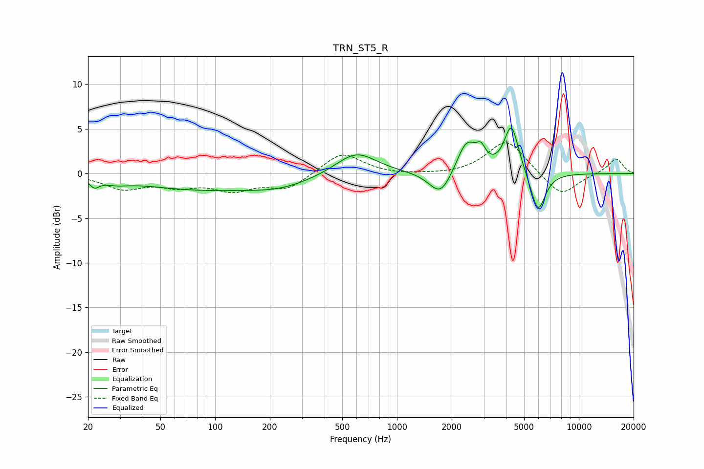

# TRN_ST5_R
See [usage instructions](https://github.com/jaakkopasanen/AutoEq#usage) for more options and info.

### Parametric EQs
Apply preamp of -5.2 dB when using parametric equalizer.

|   # | Type    |   Fc (Hz) |    Q |   Gain (dB) |
|-----|---------|-----------|------|-------------|
|   1 | Peaking |        22 | 5.88 |        -0.8 |
|   2 | Peaking |        28 | 1.78 |        -0.5 |
|   3 | Peaking |        79 | 0.44 |        -1.6 |
|   4 | Peaking |       229 | 0.76 |        -1.2 |
|   5 | Peaking |       596 | 1.26 |         2.6 |
|   6 | Peaking |      1736 | 2.27 |        -2.8 |
|   7 | Peaking |      2417 | 2.59 |         3.7 |
|   8 | Peaking |      2898 | 5.67 |         1.5 |
|   9 | Peaking |      4258 | 3.55 |         5.4 |
|  10 | Peaking |      5960 | 3.44 |        -4.6 |

### Fixed Band EQs
When using fixed band (also called graphic) equalizer, apply preamp of **-3.5 dB** (if available) and set gains manually with these parameters.

|   # | Type    |   Fc (Hz) |    Q |   Gain (dB) |
|-----|---------|-----------|------|-------------|
|   1 | Peaking |        31 | 1.41 |        -1.6 |
|   2 | Peaking |        62 | 1.41 |        -1.2 |
|   3 | Peaking |       125 | 1.41 |        -1.7 |
|   4 | Peaking |       250 | 1.41 |        -1.7 |
|   5 | Peaking |       500 | 1.41 |         2.4 |
|   6 | Peaking |      1000 | 1.41 |        -0.2 |
|   7 | Peaking |      2000 | 1.41 |        -0.2 |
|   8 | Peaking |      4000 | 1.41 |         3.8 |
|   9 | Peaking |      8000 | 1.41 |        -2.6 |
|  10 | Peaking |     16000 | 1.41 |         1.7 |

### Graphs

