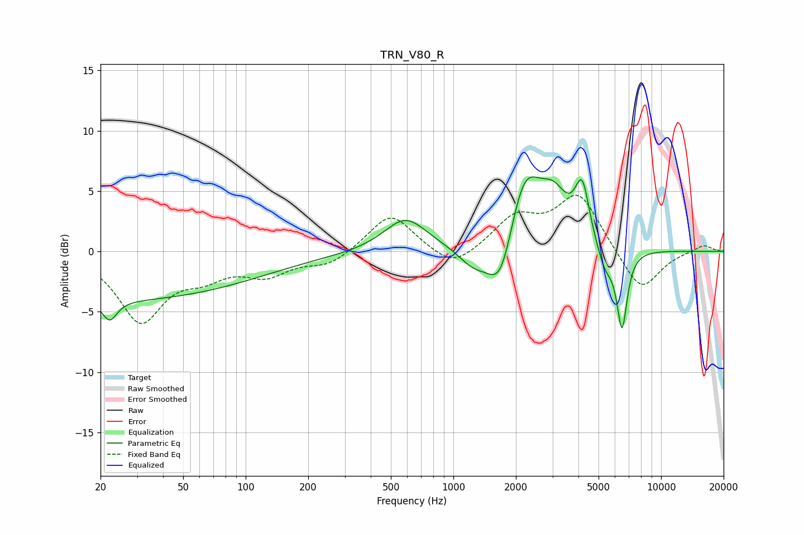

# TRN_V80_R
See [usage instructions](https://github.com/jaakkopasanen/AutoEq#usage) for more options and info.

### Parametric EQs
Apply preamp of -6.3 dB when using parametric equalizer.

|   # | Type    |   Fc (Hz) |    Q |   Gain (dB) |
|-----|---------|-----------|------|-------------|
|   1 | Peaking |        22 | 4.15 |        -1.7 |
|   2 | Peaking |        22 | 0.18 |        -4   |
|   3 | Peaking |       588 | 1.37 |         2.8 |
|   4 | Peaking |      1244 | 1.95 |        -1.5 |
|   5 | Peaking |      1695 | 2.08 |        -5.3 |
|   6 | Peaking |      2185 | 1.64 |         7.1 |
|   7 | Peaking |      3056 | 2.14 |         3   |
|   8 | Peaking |      4170 | 4.05 |         4.7 |
|   9 | Peaking |      5372 | 3.41 |        -2   |
|  10 | Peaking |      6488 | 5.46 |        -6.4 |

### Fixed Band EQs
When using fixed band (also called graphic) equalizer, apply preamp of **-4.7 dB** (if available) and set gains manually with these parameters.

|   # | Type    |   Fc (Hz) |    Q |   Gain (dB) |
|-----|---------|-----------|------|-------------|
|   1 | Peaking |        31 | 1.41 |        -5.6 |
|   2 | Peaking |        62 | 1.41 |        -1.6 |
|   3 | Peaking |       125 | 1.41 |        -1.7 |
|   4 | Peaking |       250 | 1.41 |        -1.1 |
|   5 | Peaking |       500 | 1.41 |         3.2 |
|   6 | Peaking |      1000 | 1.41 |        -1.7 |
|   7 | Peaking |      2000 | 1.41 |         2.7 |
|   8 | Peaking |      4000 | 1.41 |         4.7 |
|   9 | Peaking |      8000 | 1.41 |        -3.5 |
|  10 | Peaking |     16000 | 1.41 |         0.6 |

### Graphs

