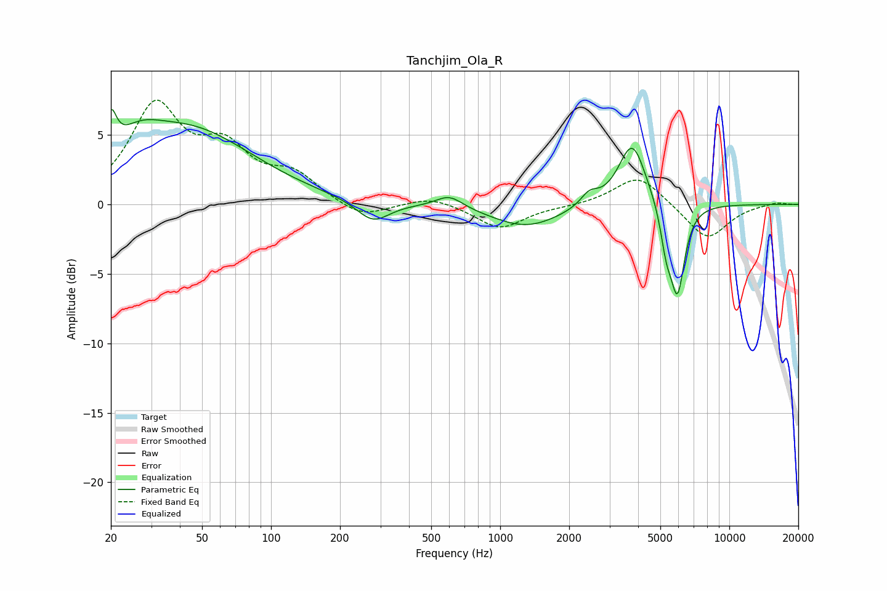

# Tanchjim_Ola_R
See [usage instructions](https://github.com/jaakkopasanen/AutoEq#usage) for more options and info.

### Parametric EQs
Apply preamp of -6.9 dB when using parametric equalizer.

|   # | Type    |   Fc (Hz) |    Q |   Gain (dB) |
|-----|---------|-----------|------|-------------|
|   1 | Peaking |        20 | 5.98 |         2.8 |
|   2 | Peaking |        26 | 1.44 |         1.7 |
|   3 | Peaking |        44 | 0.5  |         5.2 |
|   4 | Peaking |       278 | 1.97 |        -1.5 |
|   5 | Peaking |       600 | 2.38 |         0.9 |
|   6 | Peaking |      1302 | 0.93 |        -1.6 |
|   7 | Peaking |      2449 | 3.74 |         0.9 |
|   8 | Peaking |      3769 | 2.35 |         4.6 |
|   9 | Peaking |      5302 | 5.69 |        -2.4 |
|  10 | Peaking |      5938 | 4.36 |        -6.3 |

### Fixed Band EQs
When using fixed band (also called graphic) equalizer, apply preamp of **-7.6 dB** (if available) and set gains manually with these parameters.

|   # | Type    |   Fc (Hz) |    Q |   Gain (dB) |
|-----|---------|-----------|------|-------------|
|   1 | Peaking |        31 | 1.41 |         6.8 |
|   2 | Peaking |        62 | 1.41 |         3.4 |
|   3 | Peaking |       125 | 1.41 |         1.9 |
|   4 | Peaking |       250 | 1.41 |        -1.1 |
|   5 | Peaking |       500 | 1.41 |         0.6 |
|   6 | Peaking |      1000 | 1.41 |        -1.8 |
|   7 | Peaking |      2000 | 1.41 |        -0.1 |
|   8 | Peaking |      4000 | 1.41 |         2.2 |
|   9 | Peaking |      8000 | 1.41 |        -2.6 |
|  10 | Peaking |     16000 | 1.41 |         0.2 |

### Graphs

