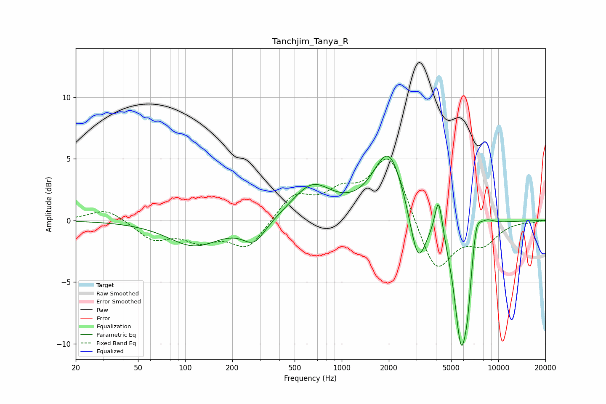

# Tanchjim_Tanya_R
See [usage instructions](https://github.com/jaakkopasanen/AutoEq#usage) for more options and info.

### Parametric EQs
Apply preamp of -5.3 dB when using parametric equalizer.

|   # | Type    |   Fc (Hz) |    Q |   Gain (dB) |
|-----|---------|-----------|------|-------------|
|   1 | Peaking |       115 | 0.84 |        -2   |
|   2 | Peaking |       276 | 1.93 |        -1.7 |
|   3 | Peaking |       648 | 1.11 |         2.8 |
|   4 | Peaking |      2006 | 1.41 |         5.7 |
|   5 | Peaking |      3063 | 2.71 |        -4.6 |
|   6 | Peaking |      4155 | 5.89 |         3.3 |
|   7 | Peaking |      5800 | 3.03 |       -10.1 |
|   8 | Peaking |      6389 | 6    |        -2.3 |
|   9 | Peaking |      7232 | 4.68 |         2.2 |
|  10 | Peaking |      8283 | 2.42 |         0.9 |

### Fixed Band EQs
When using fixed band (also called graphic) equalizer, apply preamp of **-5.1 dB** (if available) and set gains manually with these parameters.

|   # | Type    |   Fc (Hz) |    Q |   Gain (dB) |
|-----|---------|-----------|------|-------------|
|   1 | Peaking |        31 | 1.41 |         1   |
|   2 | Peaking |        62 | 1.41 |        -1.5 |
|   3 | Peaking |       125 | 1.41 |        -1.4 |
|   4 | Peaking |       250 | 1.41 |        -2.3 |
|   5 | Peaking |       500 | 1.41 |         2   |
|   6 | Peaking |      1000 | 1.41 |         1.9 |
|   7 | Peaking |      2000 | 1.41 |         5.4 |
|   8 | Peaking |      4000 | 1.41 |        -4.4 |
|   9 | Peaking |      8000 | 1.41 |        -1.7 |
|  10 | Peaking |     16000 | 1.41 |        -0.1 |

### Graphs

