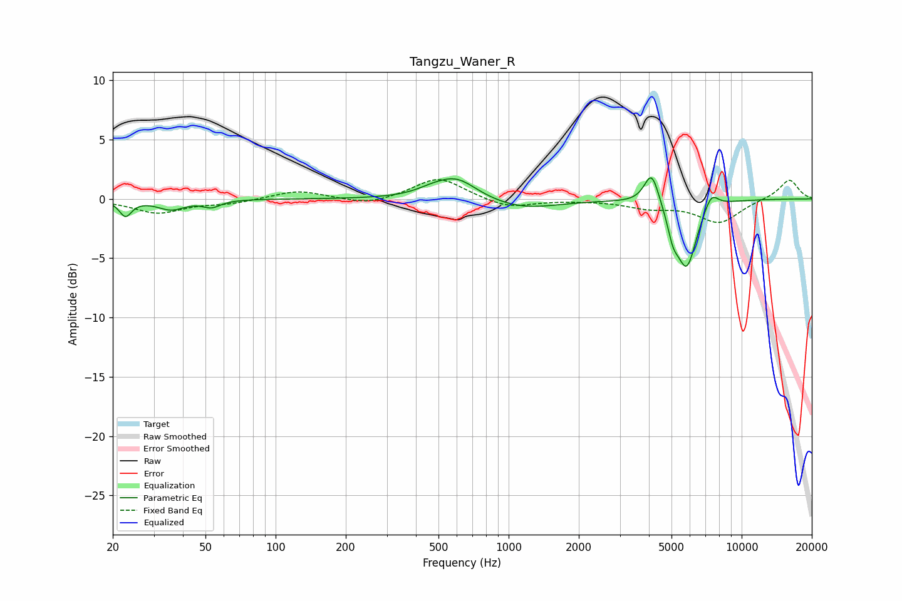

# Tangzu_Waner_R
See [usage instructions](https://github.com/jaakkopasanen/AutoEq#usage) for more options and info.

### Parametric EQs
Apply preamp of -1.9 dB when using parametric equalizer.

|   # | Type    |   Fc (Hz) |    Q |   Gain (dB) |
|-----|---------|-----------|------|-------------|
|   1 | Peaking |        23 | 5.57 |        -1.3 |
|   2 | Peaking |        36 | 2.43 |        -0.8 |
|   3 | Peaking |        53 | 3.75 |        -0.6 |
|   4 | Peaking |       469 | 1.98 |         0.4 |
|   5 | Peaking |       598 | 1.61 |         1.8 |
|   6 | Peaking |      1146 | 0.94 |        -0.9 |
|   7 | Peaking |      4111 | 4.42 |         2.8 |
|   8 | Peaking |      5075 | 6    |        -1.7 |
|   9 | Peaking |      5805 | 3.18 |        -5.6 |
|  10 | Peaking |      7405 | 4.42 |         1.4 |

### Fixed Band EQs
When using fixed band (also called graphic) equalizer, apply preamp of **-1.7 dB** (if available) and set gains manually with these parameters.

|   # | Type    |   Fc (Hz) |    Q |   Gain (dB) |
|-----|---------|-----------|------|-------------|
|   1 | Peaking |        31 | 1.41 |        -1.2 |
|   2 | Peaking |        62 | 1.41 |        -0.3 |
|   3 | Peaking |       125 | 1.41 |         0.7 |
|   4 | Peaking |       250 | 1.41 |        -0.6 |
|   5 | Peaking |       500 | 1.41 |         1.9 |
|   6 | Peaking |      1000 | 1.41 |        -0.8 |
|   7 | Peaking |      2000 | 1.41 |        -0.1 |
|   8 | Peaking |      4000 | 1.41 |        -0.7 |
|   9 | Peaking |      8000 | 1.41 |        -2   |
|  10 | Peaking |     16000 | 1.41 |         1.7 |

### Graphs

