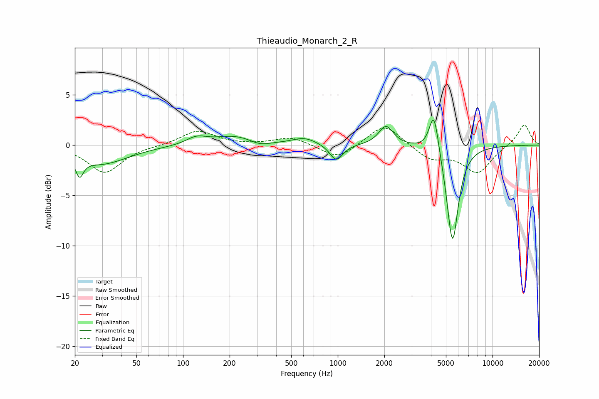

# Thieaudio_Monarch_2_R
See [usage instructions](https://github.com/jaakkopasanen/AutoEq#usage) for more options and info.

### Parametric EQs
Apply preamp of -2.6 dB when using parametric equalizer.

|   # | Type    |   Fc (Hz) |    Q |   Gain (dB) |
|-----|---------|-----------|------|-------------|
|   1 | Peaking |        21 | 5.77 |        -1.8 |
|   2 | Peaking |        30 | 0.81 |        -1.9 |
|   3 | Peaking |       122 | 2.19 |         0.7 |
|   4 | Peaking |       217 | 1.04 |         0.9 |
|   5 | Peaking |       313 | 2.1  |        -0.5 |
|   6 | Peaking |       610 | 1.78 |         0.7 |
|   7 | Peaking |       978 | 3.37 |        -1.7 |
|   8 | Peaking |      2049 | 3.06 |         1.9 |
|   9 | Peaking |      4183 | 4.59 |         4.2 |
|  10 | Peaking |      5515 | 3.66 |        -9.8 |

### Fixed Band EQs
When using fixed band (also called graphic) equalizer, apply preamp of **-2.1 dB** (if available) and set gains manually with these parameters.

|   # | Type    |   Fc (Hz) |    Q |   Gain (dB) |
|-----|---------|-----------|------|-------------|
|   1 | Peaking |        31 | 1.41 |        -2.7 |
|   2 | Peaking |        62 | 1.41 |        -0   |
|   3 | Peaking |       125 | 1.41 |         1.5 |
|   4 | Peaking |       250 | 1.41 |        -0   |
|   5 | Peaking |       500 | 1.41 |         0.8 |
|   6 | Peaking |      1000 | 1.41 |        -1.4 |
|   7 | Peaking |      2000 | 1.41 |         2.2 |
|   8 | Peaking |      4000 | 1.41 |        -1.4 |
|   9 | Peaking |      8000 | 1.41 |        -2.7 |
|  10 | Peaking |     16000 | 1.41 |         2.1 |

### Graphs

