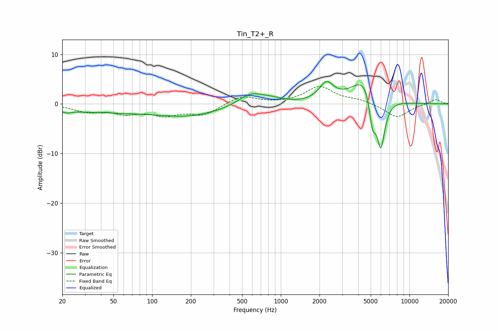

# Tin_T2+_R
See [usage instructions](https://github.com/jaakkopasanen/AutoEq#usage) for more options and info.

### Parametric EQs
Apply preamp of -4.6 dB when using parametric equalizer.

|   # | Type    |   Fc (Hz) |    Q |   Gain (dB) |
|-----|---------|-----------|------|-------------|
|   1 | Peaking |        22 | 3.51 |        -0.7 |
|   2 | Peaking |        30 | 1.98 |        -0.1 |
|   3 | Peaking |       101 | 0.18 |        -1.9 |
|   4 | Peaking |       194 | 0.78 |        -0.9 |
|   5 | Peaking |       590 | 1.32 |         2.8 |
|   6 | Peaking |       874 | 1.81 |         0.6 |
|   7 | Peaking |      2261 | 2.53 |         3.6 |
|   8 | Peaking |      4569 | 1.41 |         6   |
|   9 | Peaking |      5163 | 5.2  |        -6.6 |
|  10 | Peaking |      5987 | 4.07 |       -10.8 |

### Fixed Band EQs
When using fixed band (also called graphic) equalizer, apply preamp of **-3.6 dB** (if available) and set gains manually with these parameters.

|   # | Type    |   Fc (Hz) |    Q |   Gain (dB) |
|-----|---------|-----------|------|-------------|
|   1 | Peaking |        31 | 1.41 |        -1.4 |
|   2 | Peaking |        62 | 1.41 |        -1.6 |
|   3 | Peaking |       125 | 1.41 |        -2   |
|   4 | Peaking |       250 | 1.41 |        -2.1 |
|   5 | Peaking |       500 | 1.41 |         1.7 |
|   6 | Peaking |      1000 | 1.41 |         0.1 |
|   7 | Peaking |      2000 | 1.41 |         3.4 |
|   8 | Peaking |      4000 | 1.41 |         0.7 |
|   9 | Peaking |      8000 | 1.41 |        -2.8 |
|  10 | Peaking |     16000 | 1.41 |         1   |

### Graphs

