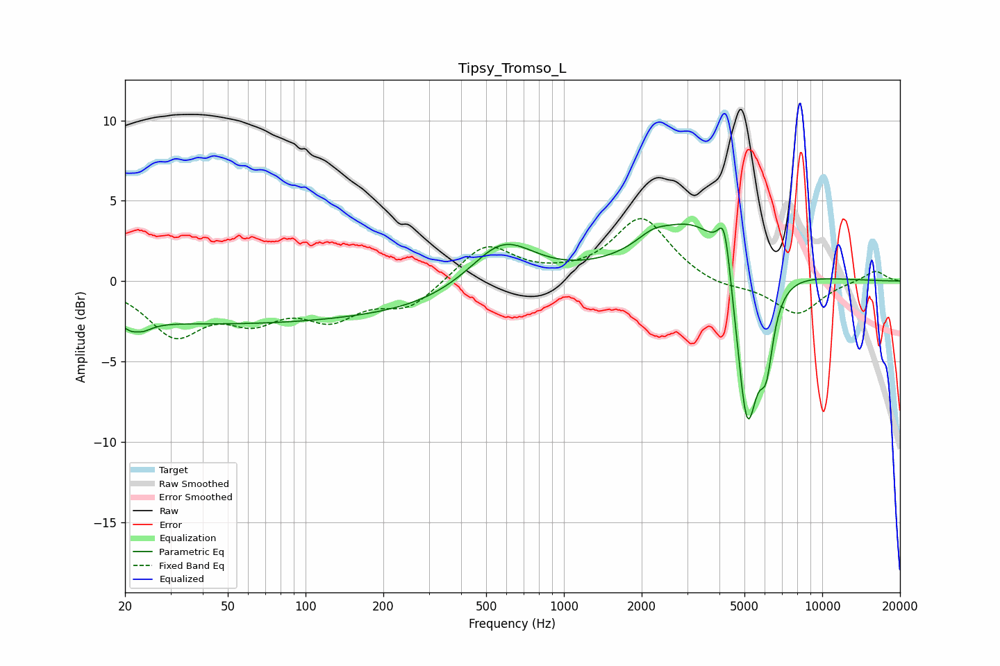

# Tipsy_Tromso_L
See [usage instructions](https://github.com/jaakkopasanen/AutoEq#usage) for more options and info.

### Parametric EQs
Apply preamp of -3.6 dB when using parametric equalizer.

|   # | Type    |   Fc (Hz) |    Q |   Gain (dB) |
|-----|---------|-----------|------|-------------|
|   1 | Peaking |        22 | 4.19 |        -2.8 |
|   2 | Peaking |        22 | 4.94 |         2   |
|   3 | Peaking |        43 | 0.21 |        -2.6 |
|   4 | Peaking |       292 | 0.53 |        -0.9 |
|   5 | Peaking |       577 | 1.13 |         2.9 |
|   6 | Peaking |      2195 | 2.42 |         0.6 |
|   7 | Peaking |      3407 | 0.76 |         4.3 |
|   8 | Peaking |      4188 | 5.57 |         3.4 |
|   9 | Peaking |      5118 | 3.03 |       -11.2 |
|  10 | Peaking |      6074 | 5.35 |        -3.7 |

### Fixed Band EQs
When using fixed band (also called graphic) equalizer, apply preamp of **-4.0 dB** (if available) and set gains manually with these parameters.

|   # | Type    |   Fc (Hz) |    Q |   Gain (dB) |
|-----|---------|-----------|------|-------------|
|   1 | Peaking |        31 | 1.41 |        -3.1 |
|   2 | Peaking |        62 | 1.41 |        -2   |
|   3 | Peaking |       125 | 1.41 |        -2   |
|   4 | Peaking |       250 | 1.41 |        -1.6 |
|   5 | Peaking |       500 | 1.41 |         2.3 |
|   6 | Peaking |      1000 | 1.41 |         0.1 |
|   7 | Peaking |      2000 | 1.41 |         3.9 |
|   8 | Peaking |      4000 | 1.41 |        -0.5 |
|   9 | Peaking |      8000 | 1.41 |        -2.1 |
|  10 | Peaking |     16000 | 1.41 |         0.7 |

### Graphs

