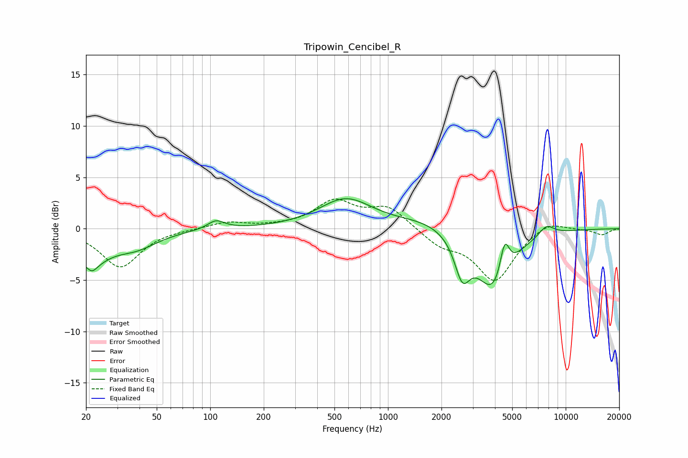

# Tripowin_Cencibel_R
See [usage instructions](https://github.com/jaakkopasanen/AutoEq#usage) for more options and info.

### Parametric EQs
Apply preamp of -3.0 dB when using parametric equalizer.

|   # | Type    |   Fc (Hz) |    Q |   Gain (dB) |
|-----|---------|-----------|------|-------------|
|   1 | Peaking |        21 | 1.38 |        -3   |
|   2 | Peaking |        22 | 5.47 |        -0.6 |
|   3 | Peaking |        38 | 1.14 |        -1.5 |
|   4 | Peaking |       108 | 2.97 |         0.9 |
|   5 | Peaking |       578 | 0.95 |         2.8 |
|   6 | Peaking |      1680 | 0.8  |         0.8 |
|   7 | Peaking |      2620 | 3.3  |        -3.7 |
|   8 | Peaking |      3955 | 1.44 |        -6.1 |
|   9 | Peaking |      4531 | 5.1  |         3.5 |
|  10 | Peaking |      7791 | 3.13 |         1   |

### Fixed Band EQs
When using fixed band (also called graphic) equalizer, apply preamp of **-3.0 dB** (if available) and set gains manually with these parameters.

|   # | Type    |   Fc (Hz) |    Q |   Gain (dB) |
|-----|---------|-----------|------|-------------|
|   1 | Peaking |        31 | 1.41 |        -3.7 |
|   2 | Peaking |        62 | 1.41 |        -0   |
|   3 | Peaking |       125 | 1.41 |         0.6 |
|   4 | Peaking |       250 | 1.41 |         0.1 |
|   5 | Peaking |       500 | 1.41 |         2.6 |
|   6 | Peaking |      1000 | 1.41 |         2   |
|   7 | Peaking |      2000 | 1.41 |        -1.5 |
|   8 | Peaking |      4000 | 1.41 |        -5   |
|   9 | Peaking |      8000 | 1.41 |         0.9 |
|  10 | Peaking |     16000 | 1.41 |        -0.6 |

### Graphs

