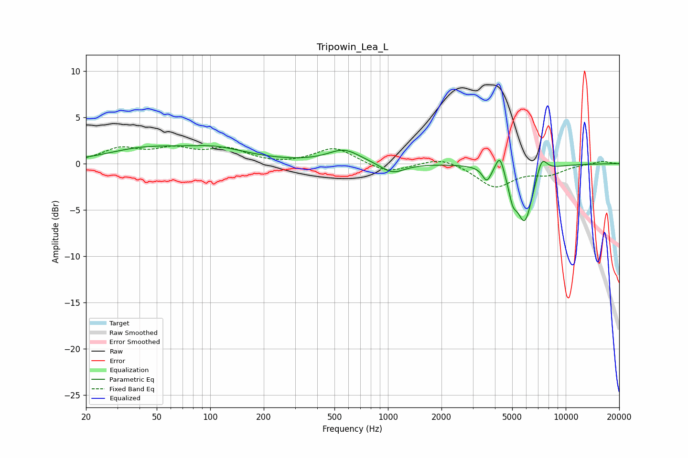

# Tripowin_Lea_L
See [usage instructions](https://github.com/jaakkopasanen/AutoEq#usage) for more options and info.

### Parametric EQs
Apply preamp of -2.0 dB when using parametric equalizer.

|   # | Type    |   Fc (Hz) |    Q |   Gain (dB) |
|-----|---------|-----------|------|-------------|
|   1 | Peaking |        40 | 0.72 |         1.2 |
|   2 | Peaking |        81 | 1.61 |        -0.2 |
|   3 | Peaking |        97 | 0.69 |         1.7 |
|   4 | Peaking |       566 | 1.55 |         1.5 |
|   5 | Peaking |      1061 | 2.08 |        -1.1 |
|   6 | Peaking |      3598 | 5.87 |        -1.5 |
|   7 | Peaking |      4261 | 6    |         2.1 |
|   8 | Peaking |      5037 | 5.99 |        -2.1 |
|   9 | Peaking |      5882 | 3    |        -6.1 |
|  10 | Peaking |      7333 | 4.54 |         2   |

### Fixed Band EQs
When using fixed band (also called graphic) equalizer, apply preamp of **-2.0 dB** (if available) and set gains manually with these parameters.

|   # | Type    |   Fc (Hz) |    Q |   Gain (dB) |
|-----|---------|-----------|------|-------------|
|   1 | Peaking |        31 | 1.41 |         1.5 |
|   2 | Peaking |        62 | 1.41 |         1.4 |
|   3 | Peaking |       125 | 1.41 |         1.4 |
|   4 | Peaking |       250 | 1.41 |        -0.2 |
|   5 | Peaking |       500 | 1.41 |         1.7 |
|   6 | Peaking |      1000 | 1.41 |        -1   |
|   7 | Peaking |      2000 | 1.41 |         0.8 |
|   8 | Peaking |      4000 | 1.41 |        -2.5 |
|   9 | Peaking |      8000 | 1.41 |        -1   |
|  10 | Peaking |     16000 | 1.41 |         0.3 |

### Graphs

