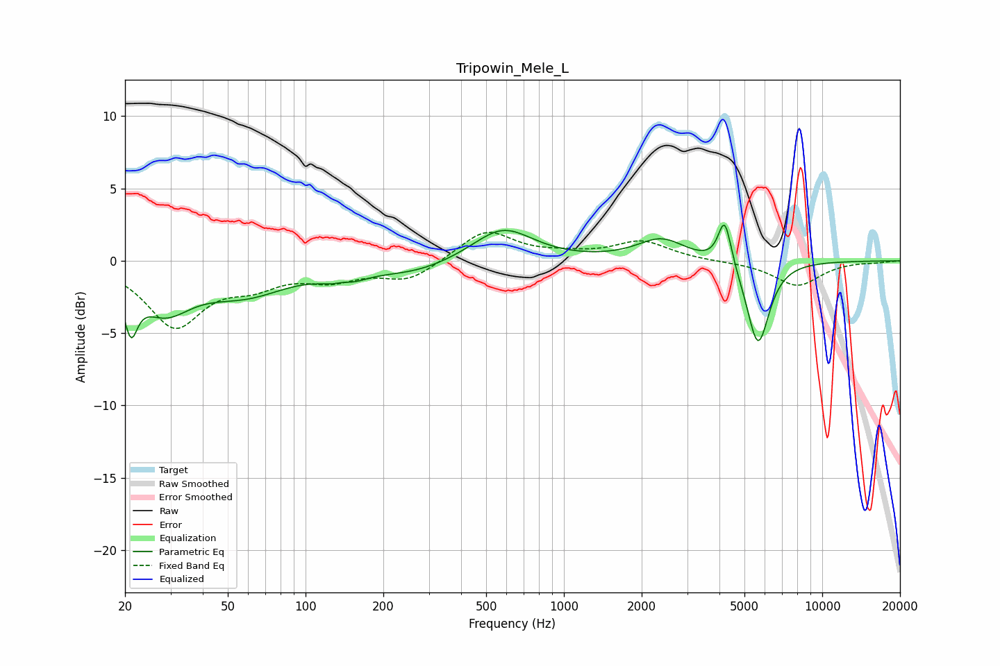

# Tripowin_Mele_L
See [usage instructions](https://github.com/jaakkopasanen/AutoEq#usage) for more options and info.

### Parametric EQs
Apply preamp of -2.6 dB when using parametric equalizer.

|   # | Type    |   Fc (Hz) |    Q |   Gain (dB) |
|-----|---------|-----------|------|-------------|
|   1 | Peaking |        21 | 5.63 |        -3.2 |
|   2 | Peaking |        28 | 1.38 |        -2.9 |
|   3 | Peaking |        58 | 0.83 |        -2.1 |
|   4 | Peaking |       140 | 3.27 |         1   |
|   5 | Peaking |       140 | 2.31 |        -1.6 |
|   6 | Peaking |       262 | 0.9  |        -0.8 |
|   7 | Peaking |       579 | 1.22 |         2.3 |
|   8 | Peaking |      2384 | 1.52 |         1.5 |
|   9 | Peaking |      4194 | 5.58 |         3.2 |
|  10 | Peaking |      5643 | 3.19 |        -5.9 |

### Fixed Band EQs
When using fixed band (also called graphic) equalizer, apply preamp of **-2.1 dB** (if available) and set gains manually with these parameters.

|   # | Type    |   Fc (Hz) |    Q |   Gain (dB) |
|-----|---------|-----------|------|-------------|
|   1 | Peaking |        31 | 1.41 |        -4.4 |
|   2 | Peaking |        62 | 1.41 |        -1.3 |
|   3 | Peaking |       125 | 1.41 |        -1.1 |
|   4 | Peaking |       250 | 1.41 |        -1.3 |
|   5 | Peaking |       500 | 1.41 |         2.1 |
|   6 | Peaking |      1000 | 1.41 |         0.3 |
|   7 | Peaking |      2000 | 1.41 |         1.3 |
|   8 | Peaking |      4000 | 1.41 |        -0   |
|   9 | Peaking |      8000 | 1.41 |        -1.7 |
|  10 | Peaking |     16000 | 1.41 |        -0.1 |

### Graphs

