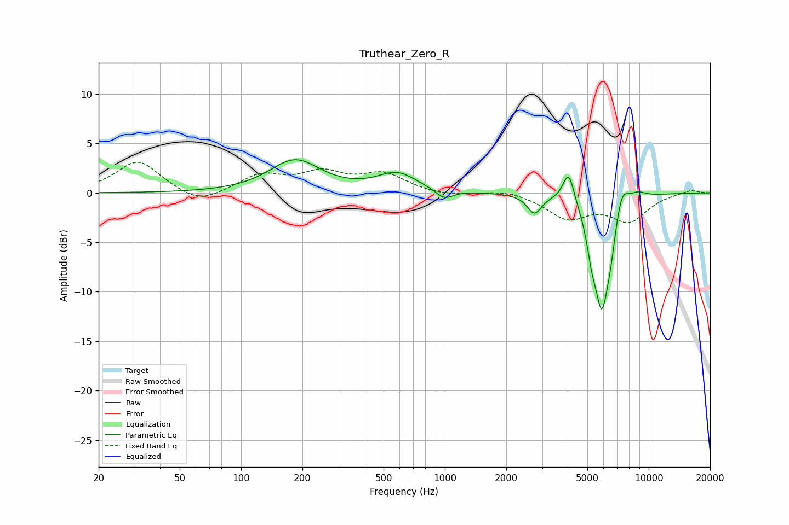

# Truthear_Zero_R
See [usage instructions](https://github.com/jaakkopasanen/AutoEq#usage) for more options and info.

### Parametric EQs
Apply preamp of -3.4 dB when using parametric equalizer.

|   # | Type    |   Fc (Hz) |    Q |   Gain (dB) |
|-----|---------|-----------|------|-------------|
|   1 | Peaking |       184 | 1.15 |         3.3 |
|   2 | Peaking |       582 | 1.47 |         1.9 |
|   3 | Peaking |       993 | 3.34 |        -1   |
|   4 | Peaking |      2748 | 4.12 |        -1.9 |
|   5 | Peaking |      4048 | 5.08 |         3.2 |
|   6 | Peaking |      5247 | 6    |        -2.4 |
|   7 | Peaking |      5889 | 3.52 |       -11   |
|   8 | Peaking |      6504 | 6    |        -1.8 |
|   9 | Peaking |      7390 | 4.44 |         2.3 |
|  10 | Peaking |      8780 | 3.05 |         0.7 |

### Fixed Band EQs
When using fixed band (also called graphic) equalizer, apply preamp of **-3.2 dB** (if available) and set gains manually with these parameters.

|   # | Type    |   Fc (Hz) |    Q |   Gain (dB) |
|-----|---------|-----------|------|-------------|
|   1 | Peaking |        31 | 1.41 |         3.3 |
|   2 | Peaking |        62 | 1.41 |        -1.3 |
|   3 | Peaking |       125 | 1.41 |         1.7 |
|   4 | Peaking |       250 | 1.41 |         1.8 |
|   5 | Peaking |       500 | 1.41 |         1.8 |
|   6 | Peaking |      1000 | 1.41 |        -0.3 |
|   7 | Peaking |      2000 | 1.41 |         0.4 |
|   8 | Peaking |      4000 | 1.41 |        -2.4 |
|   9 | Peaking |      8000 | 1.41 |        -2.7 |
|  10 | Peaking |     16000 | 1.41 |         0.4 |

### Graphs

