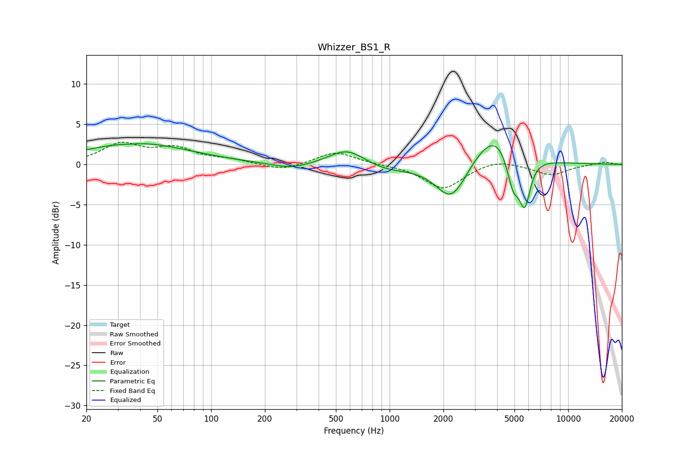

# Whizzer_BS1_R
See [usage instructions](https://github.com/jaakkopasanen/AutoEq#usage) for more options and info.

### Parametric EQs
Apply preamp of -2.7 dB when using parametric equalizer.

|   # | Type    |   Fc (Hz) |    Q |   Gain (dB) |
|-----|---------|-----------|------|-------------|
|   1 | Peaking |        35 | 2.16 |        -0.1 |
|   2 | Peaking |        39 | 0.48 |         2.7 |
|   3 | Peaking |        63 | 0.81 |        -0.1 |
|   4 | Peaking |       282 | 1.31 |        -0.7 |
|   5 | Peaking |       580 | 1.36 |         2.1 |
|   6 | Peaking |       934 | 1.02 |        -0.9 |
|   7 | Peaking |      2224 | 1.59 |        -5   |
|   8 | Peaking |      3925 | 1.14 |         4.7 |
|   9 | Peaking |      4913 | 3.87 |        -4.5 |
|  10 | Peaking |      5713 | 4.36 |        -5.8 |

### Fixed Band EQs
When using fixed band (also called graphic) equalizer, apply preamp of **-2.9 dB** (if available) and set gains manually with these parameters.

|   # | Type    |   Fc (Hz) |    Q |   Gain (dB) |
|-----|---------|-----------|------|-------------|
|   1 | Peaking |        31 | 1.41 |         2.4 |
|   2 | Peaking |        62 | 1.41 |         1.8 |
|   3 | Peaking |       125 | 1.41 |         0.5 |
|   4 | Peaking |       250 | 1.41 |        -0.8 |
|   5 | Peaking |       500 | 1.41 |         1.6 |
|   6 | Peaking |      1000 | 1.41 |        -0   |
|   7 | Peaking |      2000 | 1.41 |        -3   |
|   8 | Peaking |      4000 | 1.41 |         0.7 |
|   9 | Peaking |      8000 | 1.41 |        -1.3 |
|  10 | Peaking |     16000 | 1.41 |         0.3 |

### Graphs

