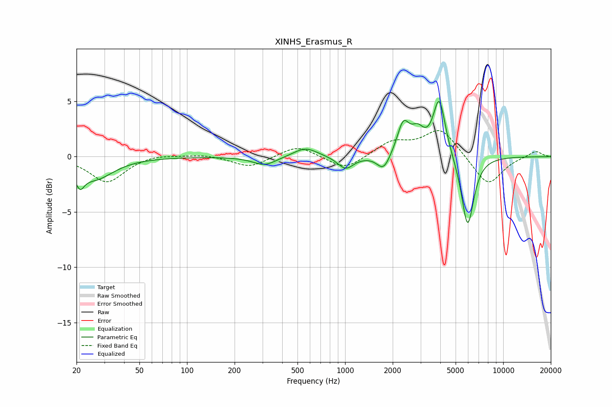

# XINHS_Erasmus_R
See [usage instructions](https://github.com/jaakkopasanen/AutoEq#usage) for more options and info.

### Parametric EQs
Apply preamp of -5.1 dB when using parametric equalizer.

|   # | Type    |   Fc (Hz) |    Q |   Gain (dB) |
|-----|---------|-----------|------|-------------|
|   1 | Peaking |        21 | 5.28 |        -1.4 |
|   2 | Peaking |        26 | 1.21 |        -1.9 |
|   3 | Peaking |       310 | 1.9  |        -0.8 |
|   4 | Peaking |       561 | 1.87 |         0.9 |
|   5 | Peaking |      1007 | 2.83 |        -1.2 |
|   6 | Peaking |      1751 | 3.45 |        -1.5 |
|   7 | Peaking |      2333 | 3.72 |         2.8 |
|   8 | Peaking |      2875 | 3.35 |         1.7 |
|   9 | Peaking |      3942 | 3.66 |         5.2 |
|  10 | Peaking |      5956 | 3.51 |        -6.5 |

### Fixed Band EQs
When using fixed band (also called graphic) equalizer, apply preamp of **-2.5 dB** (if available) and set gains manually with these parameters.

|   # | Type    |   Fc (Hz) |    Q |   Gain (dB) |
|-----|---------|-----------|------|-------------|
|   1 | Peaking |        31 | 1.41 |        -2.3 |
|   2 | Peaking |        62 | 1.41 |         0.3 |
|   3 | Peaking |       125 | 1.41 |         0.2 |
|   4 | Peaking |       250 | 1.41 |        -1   |
|   5 | Peaking |       500 | 1.41 |         1.1 |
|   6 | Peaking |      1000 | 1.41 |        -1.3 |
|   7 | Peaking |      2000 | 1.41 |         1.3 |
|   8 | Peaking |      4000 | 1.41 |         2.5 |
|   9 | Peaking |      8000 | 1.41 |        -2.7 |
|  10 | Peaking |     16000 | 1.41 |         0.6 |

### Graphs

