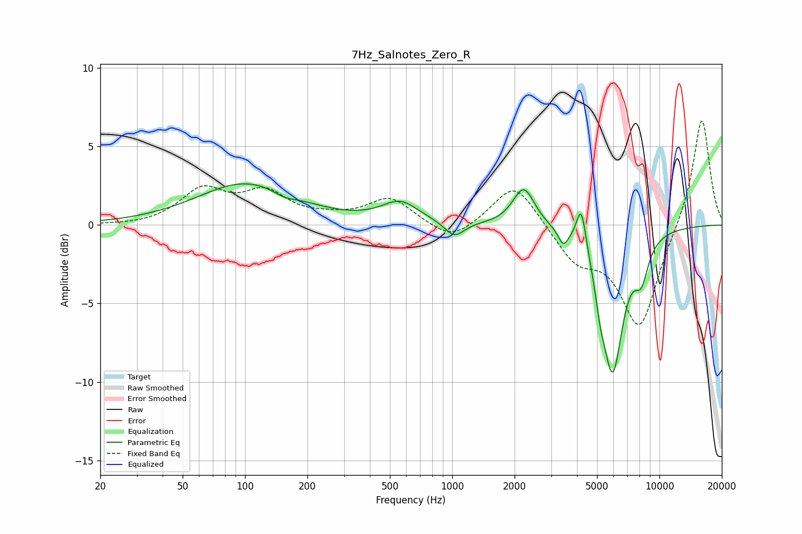

# 7Hz_Salnotes_Zero_R
See [usage instructions](https://github.com/jaakkopasanen/AutoEq#usage) for more options and info.

### Parametric EQs
Apply preamp of -2.7 dB when using parametric equalizer.

|   # | Type    |   Fc (Hz) |    Q |   Gain (dB) |
|-----|---------|-----------|------|-------------|
|   1 | Peaking |       102 | 0.6  |         2.7 |
|   2 | Peaking |       155 | 2.55 |        -0.4 |
|   3 | Peaking |       561 | 1.6  |         1.3 |
|   4 | Peaking |      1024 | 2.97 |        -1   |
|   5 | Peaking |      2214 | 2.7  |         2.5 |
|   6 | Peaking |      3436 | 5.92 |        -1   |
|   7 | Peaking |      4196 | 6    |         2.7 |
|   8 | Peaking |      5179 | 6    |        -1.4 |
|   9 | Peaking |      5939 | 2.65 |        -9   |
|  10 | Peaking |      8180 | 3.89 |        -2.2 |

### Fixed Band EQs
When using fixed band (also called graphic) equalizer, apply preamp of **-6.7 dB** (if available) and set gains manually with these parameters.

|   # | Type    |   Fc (Hz) |    Q |   Gain (dB) |
|-----|---------|-----------|------|-------------|
|   1 | Peaking |        31 | 1.41 |        -0.1 |
|   2 | Peaking |        62 | 1.41 |         2.1 |
|   3 | Peaking |       125 | 1.41 |         1.9 |
|   4 | Peaking |       250 | 1.41 |         0.3 |
|   5 | Peaking |       500 | 1.41 |         1.7 |
|   6 | Peaking |      1000 | 1.41 |        -1.2 |
|   7 | Peaking |      2000 | 1.41 |         2.8 |
|   8 | Peaking |      4000 | 1.41 |        -2.1 |
|   9 | Peaking |      8000 | 1.41 |        -6.5 |
|  10 | Peaking |     16000 | 1.41 |         7   |

### Graphs

