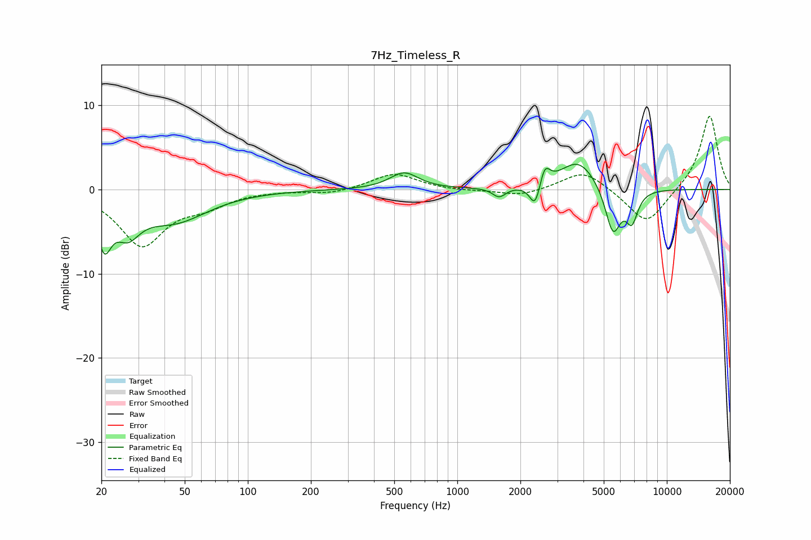

# 7Hz_Timeless_R
See [usage instructions](https://github.com/jaakkopasanen/AutoEq#usage) for more options and info.

### Parametric EQs
Apply preamp of -3.1 dB when using parametric equalizer.

|   # | Type    |   Fc (Hz) |    Q |   Gain (dB) |
|-----|---------|-----------|------|-------------|
|   1 | Peaking |        21 | 4.22 |        -5.1 |
|   2 | Peaking |        27 | 2.44 |        -3.5 |
|   3 | Peaking |        44 | 0.88 |        -3.6 |
|   4 | Peaking |       557 | 2.07 |         2   |
|   5 | Peaking |      1584 | 4.59 |        -1.1 |
|   6 | Peaking |      2353 | 5.54 |        -3   |
|   7 | Peaking |      2612 | 5.95 |         2.3 |
|   8 | Peaking |      3790 | 1.58 |         3.6 |
|   9 | Peaking |      5533 | 3.7  |        -5.7 |
|  10 | Peaking |      6809 | 4.76 |        -3.5 |

### Fixed Band EQs
When using fixed band (also called graphic) equalizer, apply preamp of **-8.8 dB** (if available) and set gains manually with these parameters.

|   # | Type    |   Fc (Hz) |    Q |   Gain (dB) |
|-----|---------|-----------|------|-------------|
|   1 | Peaking |        31 | 1.41 |        -6.5 |
|   2 | Peaking |        62 | 1.41 |        -1.6 |
|   3 | Peaking |       125 | 1.41 |        -0   |
|   4 | Peaking |       250 | 1.41 |        -0.5 |
|   5 | Peaking |       500 | 1.41 |         1.9 |
|   6 | Peaking |      1000 | 1.41 |        -0.2 |
|   7 | Peaking |      2000 | 1.41 |        -0.8 |
|   8 | Peaking |      4000 | 1.41 |         2.4 |
|   9 | Peaking |      8000 | 1.41 |        -4.3 |
|  10 | Peaking |     16000 | 1.41 |         8.9 |

### Graphs

