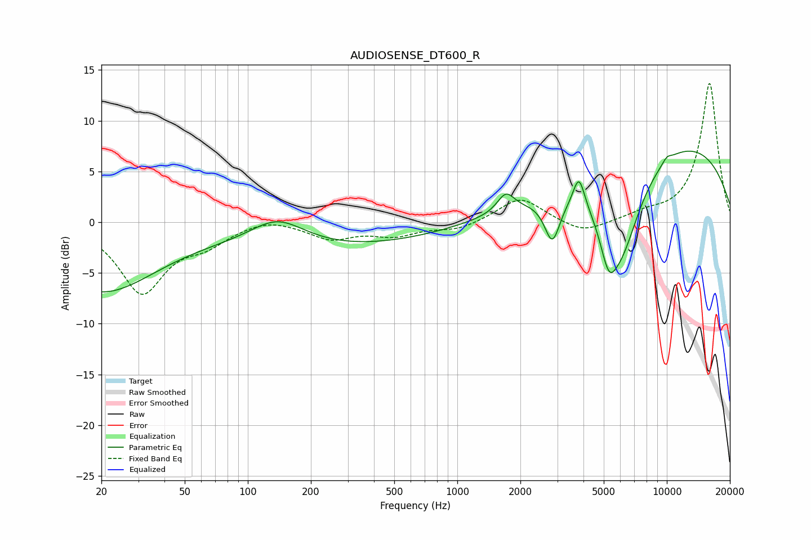

# AUDIOSENSE_DT600_R
See [usage instructions](https://github.com/jaakkopasanen/AutoEq#usage) for more options and info.

### Parametric EQs
Apply preamp of -7.1 dB when using parametric equalizer.

|   # | Type    |   Fc (Hz) |    Q |   Gain (dB) |
|-----|---------|-----------|------|-------------|
|   1 | Peaking |        20 | 0.53 |        -6.7 |
|   2 | Peaking |       138 | 1.07 |         2.7 |
|   3 | Peaking |       251 | 0.29 |        -2.5 |
|   4 | Peaking |      1705 | 3.48 |         1.9 |
|   5 | Peaking |      2842 | 3.8  |        -4.3 |
|   6 | Peaking |      3806 | 5.18 |         3.1 |
|   7 | Peaking |      5275 | 3.52 |        -3.9 |
|   8 | Peaking |      6037 | 1.35 |        -9.2 |
|   9 | Peaking |     10000 | 5.71 |         0.5 |
|  10 | Peaking |     10000 | 0.26 |         8.3 |

### Fixed Band EQs
When using fixed band (also called graphic) equalizer, apply preamp of **-13.8 dB** (if available) and set gains manually with these parameters.

|   # | Type    |   Fc (Hz) |    Q |   Gain (dB) |
|-----|---------|-----------|------|-------------|
|   1 | Peaking |        31 | 1.41 |        -6.8 |
|   2 | Peaking |        62 | 1.41 |        -1.7 |
|   3 | Peaking |       125 | 1.41 |         0.6 |
|   4 | Peaking |       250 | 1.41 |        -1.5 |
|   5 | Peaking |       500 | 1.41 |        -1.2 |
|   6 | Peaking |      1000 | 1.41 |        -0.7 |
|   7 | Peaking |      2000 | 1.41 |         2.5 |
|   8 | Peaking |      4000 | 1.41 |        -1.2 |
|   9 | Peaking |      8000 | 1.41 |         0.7 |
|  10 | Peaking |     16000 | 1.41 |        13.7 |

### Graphs

