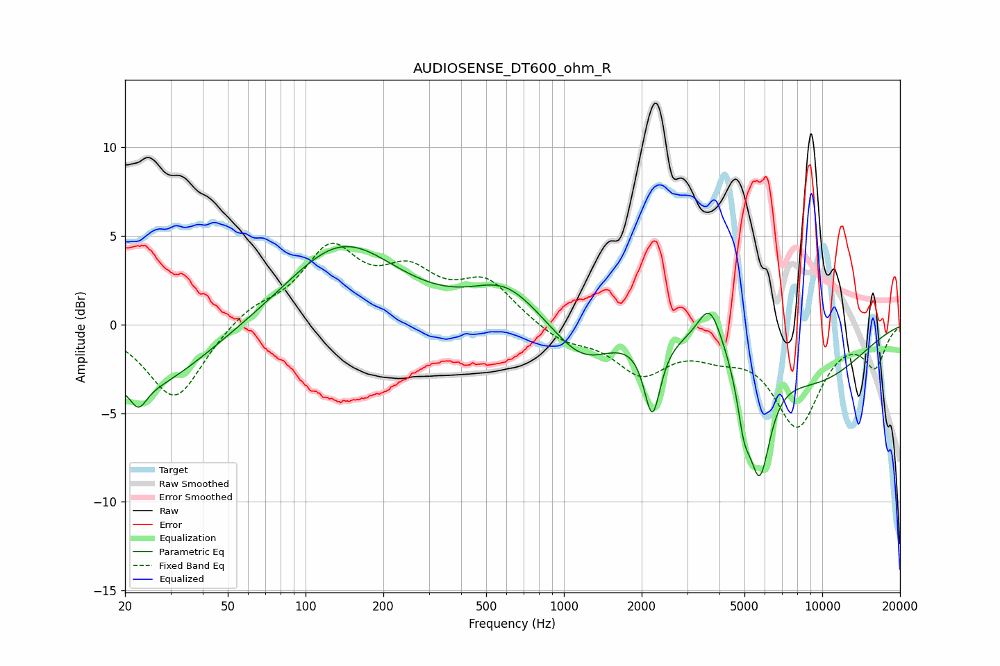

# AUDIOSENSE_DT600_ohm_R
See [usage instructions](https://github.com/jaakkopasanen/AutoEq#usage) for more options and info.

### Parametric EQs
Apply preamp of -4.5 dB when using parametric equalizer.

|   # | Type    |   Fc (Hz) |    Q |   Gain (dB) |
|-----|---------|-----------|------|-------------|
|   1 | Peaking |        23 | 4.7  |        -1.2 |
|   2 | Peaking |        23 | 0.58 |        -3.8 |
|   3 | Peaking |       138 | 0.67 |         4.6 |
|   4 | Peaking |       594 | 1.09 |         2.1 |
|   5 | Peaking |      1179 | 1.23 |        -2.1 |
|   6 | Peaking |      2200 | 4.49 |        -4.3 |
|   7 | Peaking |      3675 | 2.95 |         2.6 |
|   8 | Peaking |      4973 | 5.63 |        -2.3 |
|   9 | Peaking |      5715 | 3.24 |        -6.2 |
|  10 | Peaking |      9236 | 0.57 |        -3   |

### Fixed Band EQs
When using fixed band (also called graphic) equalizer, apply preamp of **-4.7 dB** (if available) and set gains manually with these parameters.

|   # | Type    |   Fc (Hz) |    Q |   Gain (dB) |
|-----|---------|-----------|------|-------------|
|   1 | Peaking |        31 | 1.41 |        -4.3 |
|   2 | Peaking |        62 | 1.41 |         0.9 |
|   3 | Peaking |       125 | 1.41 |         4   |
|   4 | Peaking |       250 | 1.41 |         2.5 |
|   5 | Peaking |       500 | 1.41 |         2.3 |
|   6 | Peaking |      1000 | 1.41 |        -0.9 |
|   7 | Peaking |      2000 | 1.41 |        -2.5 |
|   8 | Peaking |      4000 | 1.41 |        -1.1 |
|   9 | Peaking |      8000 | 1.41 |        -5.5 |
|  10 | Peaking |     16000 | 1.41 |        -2.2 |

### Graphs

