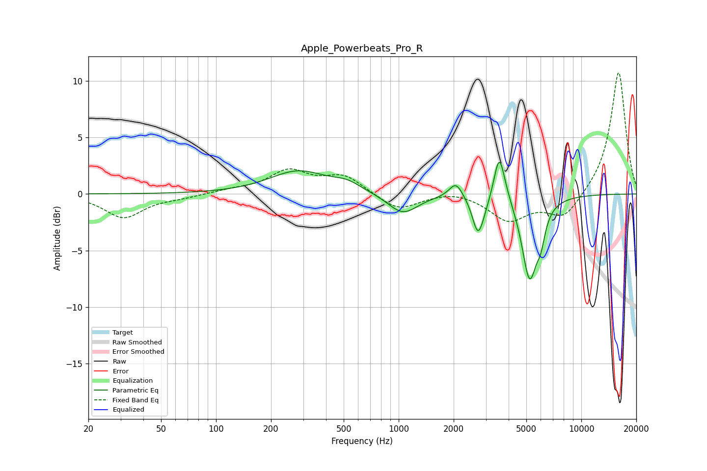

# Apple_Powerbeats_Pro_R
See [usage instructions](https://github.com/jaakkopasanen/AutoEq#usage) for more options and info.

### Parametric EQs
Apply preamp of -2.9 dB when using parametric equalizer.

|   # | Type    |   Fc (Hz) |    Q |   Gain (dB) |
|-----|---------|-----------|------|-------------|
|   1 | Peaking |       282 | 0.9  |         2   |
|   2 | Peaking |       521 | 1.83 |         0.7 |
|   3 | Peaking |      1053 | 1.72 |        -1.8 |
|   4 | Peaking |      2058 | 3.92 |         1.4 |
|   5 | Peaking |      2715 | 4.71 |        -3.2 |
|   6 | Peaking |      2930 | 3.97 |        -0.6 |
|   7 | Peaking |      3552 | 5.06 |         3.8 |
|   8 | Peaking |      3766 | 2.9  |         0.7 |
|   9 | Peaking |      5208 | 3.25 |        -7.4 |
|  10 | Peaking |      6008 | 6    |        -1.8 |

### Fixed Band EQs
When using fixed band (also called graphic) equalizer, apply preamp of **-10.8 dB** (if available) and set gains manually with these parameters.

|   # | Type    |   Fc (Hz) |    Q |   Gain (dB) |
|-----|---------|-----------|------|-------------|
|   1 | Peaking |        31 | 1.41 |        -2.1 |
|   2 | Peaking |        62 | 1.41 |        -0.3 |
|   3 | Peaking |       125 | 1.41 |         0.3 |
|   4 | Peaking |       250 | 1.41 |         2   |
|   5 | Peaking |       500 | 1.41 |         1.6 |
|   6 | Peaking |      1000 | 1.41 |        -1.5 |
|   7 | Peaking |      2000 | 1.41 |         0.4 |
|   8 | Peaking |      4000 | 1.41 |        -2.3 |
|   9 | Peaking |      8000 | 1.41 |        -2.2 |
|  10 | Peaking |     16000 | 1.41 |        10.9 |

### Graphs

