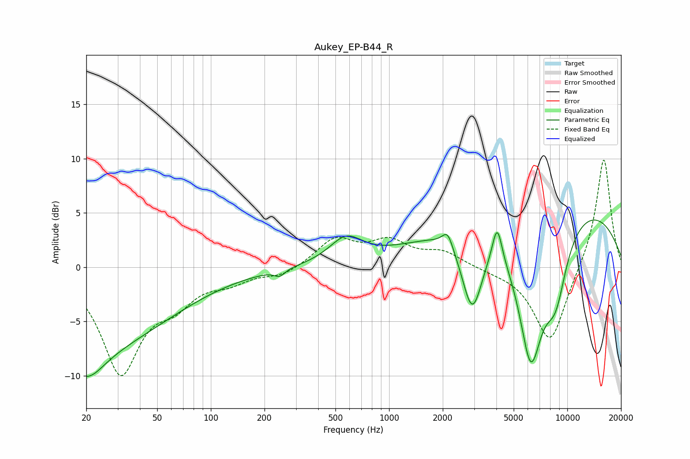

# Aukey_EP-B44_R
See [usage instructions](https://github.com/jaakkopasanen/AutoEq#usage) for more options and info.

### Parametric EQs
Apply preamp of -4.4 dB when using parametric equalizer.

|   # | Type    |   Fc (Hz) |    Q |   Gain (dB) |
|-----|---------|-----------|------|-------------|
|   1 | Peaking |        20 | 0.3  |        -7.3 |
|   2 | Peaking |        20 | 1.5  |        -2.7 |
|   3 | Peaking |       243 | 4.81 |        -0.6 |
|   4 | Peaking |       573 | 1.52 |         2.3 |
|   5 | Peaking |      2132 | 4.76 |         1.5 |
|   6 | Peaking |      2928 | 2.34 |        -7.4 |
|   7 | Peaking |      4040 | 5.16 |         3.4 |
|   8 | Peaking |      6232 | 1.74 |       -13.4 |
|   9 | Peaking |      7484 | 0.2  |         6.7 |
|  10 | Peaking |      8591 | 1.96 |        -5.8 |

### Fixed Band EQs
When using fixed band (also called graphic) equalizer, apply preamp of **-10.0 dB** (if available) and set gains manually with these parameters.

|   # | Type    |   Fc (Hz) |    Q |   Gain (dB) |
|-----|---------|-----------|------|-------------|
|   1 | Peaking |        31 | 1.41 |        -9.5 |
|   2 | Peaking |        62 | 1.41 |        -2.5 |
|   3 | Peaking |       125 | 1.41 |        -1.1 |
|   4 | Peaking |       250 | 1.41 |        -0.8 |
|   5 | Peaking |       500 | 1.41 |         2.5 |
|   6 | Peaking |      1000 | 1.41 |         2.1 |
|   7 | Peaking |      2000 | 1.41 |         1.3 |
|   8 | Peaking |      4000 | 1.41 |        -0.2 |
|   9 | Peaking |      8000 | 1.41 |        -7.1 |
|  10 | Peaking |     16000 | 1.41 |        10.3 |

### Graphs

