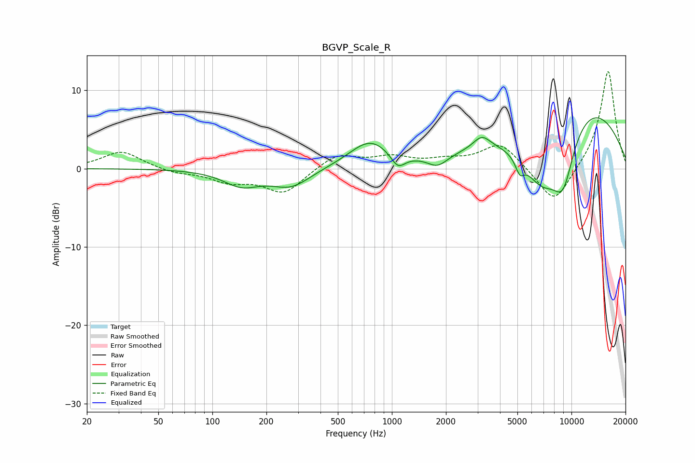

# BGVP_Scale_R
See [usage instructions](https://github.com/jaakkopasanen/AutoEq#usage) for more options and info.

### Parametric EQs
Apply preamp of -6.6 dB when using parametric equalizer.

|   # | Type    |   Fc (Hz) |    Q |   Gain (dB) |
|-----|---------|-----------|------|-------------|
|   1 | Peaking |       145 | 1.39 |        -2   |
|   2 | Peaking |       274 | 1.3  |        -2.3 |
|   3 | Peaking |       756 | 1.22 |         3.4 |
|   4 | Peaking |      1080 | 3.5  |        -1.8 |
|   5 | Peaking |      1795 | 2.58 |        -1.4 |
|   6 | Peaking |      3169 | 2.95 |         1.6 |
|   7 | Peaking |      5154 | 5.76 |        -1.8 |
|   8 | Peaking |      6812 | 1.13 |        -8.2 |
|   9 | Peaking |      8989 | 1.94 |        -7.2 |
|  10 | Peaking |     10000 | 0.33 |         9.7 |

### Fixed Band EQs
When using fixed band (also called graphic) equalizer, apply preamp of **-12.5 dB** (if available) and set gains manually with these parameters.

|   # | Type    |   Fc (Hz) |    Q |   Gain (dB) |
|-----|---------|-----------|------|-------------|
|   1 | Peaking |        31 | 1.41 |         2.2 |
|   2 | Peaking |        62 | 1.41 |        -0.5 |
|   3 | Peaking |       125 | 1.41 |        -1.5 |
|   4 | Peaking |       250 | 1.41 |        -3.1 |
|   5 | Peaking |       500 | 1.41 |         1.9 |
|   6 | Peaking |      1000 | 1.41 |         1.3 |
|   7 | Peaking |      2000 | 1.41 |         0.8 |
|   8 | Peaking |      4000 | 1.41 |         3.2 |
|   9 | Peaking |      8000 | 1.41 |        -4.8 |
|  10 | Peaking |     16000 | 1.41 |        12.7 |

### Graphs

