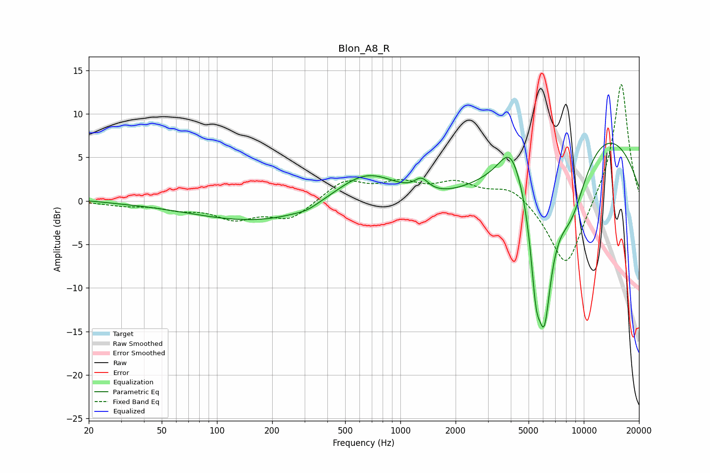

# Blon_A8_R
See [usage instructions](https://github.com/jaakkopasanen/AutoEq#usage) for more options and info.

### Parametric EQs
Apply preamp of -6.7 dB when using parametric equalizer.

|   # | Type    |   Fc (Hz) |    Q |   Gain (dB) |
|-----|---------|-----------|------|-------------|
|   1 | Peaking |        20 | 1.79 |         0.2 |
|   2 | Peaking |       309 | 2.87 |        -0.3 |
|   3 | Peaking |       426 | 0.18 |        -3.4 |
|   4 | Peaking |       652 | 0.7  |         5.8 |
|   5 | Peaking |      1304 | 3.68 |         1.4 |
|   6 | Peaking |      4001 | 2.2  |         4   |
|   7 | Peaking |      5482 | 5.01 |        -7.3 |
|   8 | Peaking |      6096 | 2.76 |       -16.3 |
|   9 | Peaking |      8552 | 1.29 |        -8.3 |
|  10 | Peaking |     10000 | 0.31 |         9.9 |

### Fixed Band EQs
When using fixed band (also called graphic) equalizer, apply preamp of **-13.5 dB** (if available) and set gains manually with these parameters.

|   # | Type    |   Fc (Hz) |    Q |   Gain (dB) |
|-----|---------|-----------|------|-------------|
|   1 | Peaking |        31 | 1.41 |        -0.4 |
|   2 | Peaking |        62 | 1.41 |        -0.8 |
|   3 | Peaking |       125 | 1.41 |        -1.9 |
|   4 | Peaking |       250 | 1.41 |        -2.1 |
|   5 | Peaking |       500 | 1.41 |         2.3 |
|   6 | Peaking |      1000 | 1.41 |         1.8 |
|   7 | Peaking |      2000 | 1.41 |         1.9 |
|   8 | Peaking |      4000 | 1.41 |         1.8 |
|   9 | Peaking |      8000 | 1.41 |        -8.1 |
|  10 | Peaking |     16000 | 1.41 |        13.9 |

### Graphs

