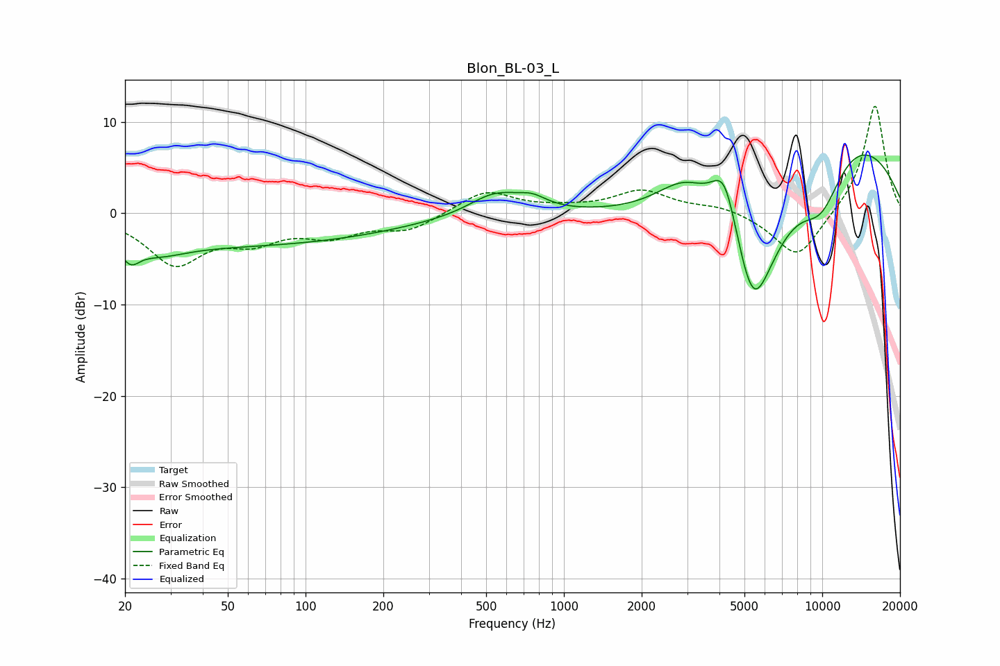

# Blon_BL-03_L
See [usage instructions](https://github.com/jaakkopasanen/AutoEq#usage) for more options and info.

### Parametric EQs
Apply preamp of -6.5 dB when using parametric equalizer.

|   # | Type    |   Fc (Hz) |    Q |   Gain (dB) |
|-----|---------|-----------|------|-------------|
|   1 | Peaking |        21 | 4.5  |        -1.6 |
|   2 | Peaking |        27 | 1.38 |        -1.1 |
|   3 | Peaking |        44 | 0.18 |        -3.6 |
|   4 | Peaking |       543 | 1.38 |         2.4 |
|   5 | Peaking |       755 | 2.46 |         1.1 |
|   6 | Peaking |      2952 | 1.22 |         4.5 |
|   7 | Peaking |      4195 | 2.47 |         7.6 |
|   8 | Peaking |      5399 | 1.03 |       -20   |
|   9 | Peaking |      9915 | 1.33 |        -6.6 |
|  10 | Peaking |     10000 | 0.35 |        12.7 |

### Fixed Band EQs
When using fixed band (also called graphic) equalizer, apply preamp of **-11.8 dB** (if available) and set gains manually with these parameters.

|   # | Type    |   Fc (Hz) |    Q |   Gain (dB) |
|-----|---------|-----------|------|-------------|
|   1 | Peaking |        31 | 1.41 |        -5.3 |
|   2 | Peaking |        62 | 1.41 |        -2.5 |
|   3 | Peaking |       125 | 1.41 |        -2.1 |
|   4 | Peaking |       250 | 1.41 |        -1.8 |
|   5 | Peaking |       500 | 1.41 |         2.5 |
|   6 | Peaking |      1000 | 1.41 |         0.4 |
|   7 | Peaking |      2000 | 1.41 |         2.4 |
|   8 | Peaking |      4000 | 1.41 |         0.8 |
|   9 | Peaking |      8000 | 1.41 |        -5.2 |
|  10 | Peaking |     16000 | 1.41 |        12.1 |

### Graphs

