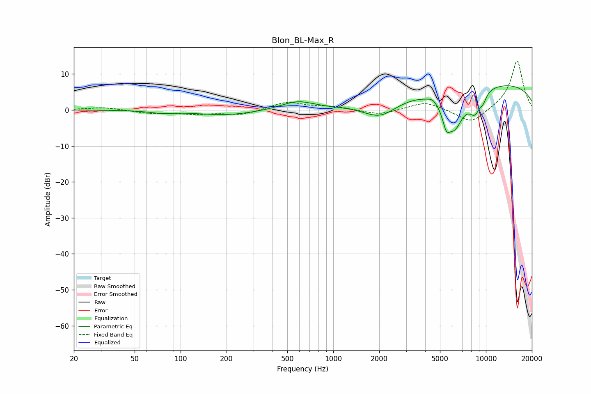

# Blon_BL-Max_R
See [usage instructions](https://github.com/jaakkopasanen/AutoEq#usage) for more options and info.

### Parametric EQs
Apply preamp of -6.8 dB when using parametric equalizer.

|   # | Type    |   Fc (Hz) |    Q |   Gain (dB) |
|-----|---------|-----------|------|-------------|
|   1 | Peaking |        75 | 1.94 |        -0.6 |
|   2 | Peaking |       199 | 0.73 |        -1.5 |
|   3 | Peaking |       581 | 1.34 |         2.4 |
|   4 | Peaking |      2030 | 1.24 |        -4.8 |
|   5 | Peaking |      4494 | 4.65 |         0.9 |
|   6 | Peaking |      5506 | 5.3  |        -4.9 |
|   7 | Peaking |      6242 | 2.12 |       -10.4 |
|   8 | Peaking |      8472 | 3.28 |        -5.4 |
|   9 | Peaking |      9604 | 5.95 |        -1.9 |
|  10 | Peaking |      9777 | 0.19 |         7.8 |

### Fixed Band EQs
When using fixed band (also called graphic) equalizer, apply preamp of **-13.7 dB** (if available) and set gains manually with these parameters.

|   # | Type    |   Fc (Hz) |    Q |   Gain (dB) |
|-----|---------|-----------|------|-------------|
|   1 | Peaking |        31 | 1.41 |         0.8 |
|   2 | Peaking |        62 | 1.41 |        -0.9 |
|   3 | Peaking |       125 | 1.41 |        -1   |
|   4 | Peaking |       250 | 1.41 |        -1.4 |
|   5 | Peaking |       500 | 1.41 |         2.3 |
|   6 | Peaking |      1000 | 1.41 |         0.9 |
|   7 | Peaking |      2000 | 1.41 |        -1.5 |
|   8 | Peaking |      4000 | 1.41 |         2.3 |
|   9 | Peaking |      8000 | 1.41 |        -4.1 |
|  10 | Peaking |     16000 | 1.41 |        13.9 |

### Graphs

