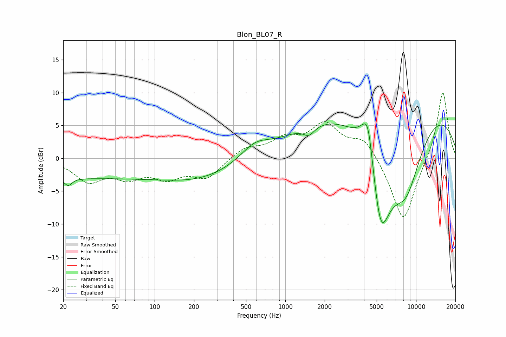

# Blon_BL07_R
See [usage instructions](https://github.com/jaakkopasanen/AutoEq#usage) for more options and info.

### Parametric EQs
Apply preamp of -5.3 dB when using parametric equalizer.

|   # | Type    |   Fc (Hz) |    Q |   Gain (dB) |
|-----|---------|-----------|------|-------------|
|   1 | Peaking |        22 | 5    |        -1.2 |
|   2 | Peaking |        22 | 0.18 |        -2.9 |
|   3 | Peaking |       231 | 0.46 |        -2.8 |
|   4 | Peaking |       583 | 1.31 |         2.1 |
|   5 | Peaking |      1516 | 3.31 |        -1.4 |
|   6 | Peaking |      4133 | 2.23 |         4.7 |
|   7 | Peaking |      4320 | 4.3  |         3.8 |
|   8 | Peaking |      5367 | 1.38 |       -17.6 |
|   9 | Peaking |      6820 | 0.2  |        12.1 |
|  10 | Peaking |      8386 | 0.9  |       -12.1 |

### Fixed Band EQs
When using fixed band (also called graphic) equalizer, apply preamp of **-10.1 dB** (if available) and set gains manually with these parameters.

|   # | Type    |   Fc (Hz) |    Q |   Gain (dB) |
|-----|---------|-----------|------|-------------|
|   1 | Peaking |        31 | 1.41 |        -3.3 |
|   2 | Peaking |        62 | 1.41 |        -2.4 |
|   3 | Peaking |       125 | 1.41 |        -2.6 |
|   4 | Peaking |       250 | 1.41 |        -2.9 |
|   5 | Peaking |       500 | 1.41 |         1.6 |
|   6 | Peaking |      1000 | 1.41 |         2.5 |
|   7 | Peaking |      2000 | 1.41 |         4.8 |
|   8 | Peaking |      4000 | 1.41 |         3.1 |
|   9 | Peaking |      8000 | 1.41 |       -10.1 |
|  10 | Peaking |     16000 | 1.41 |        10.6 |

### Graphs

