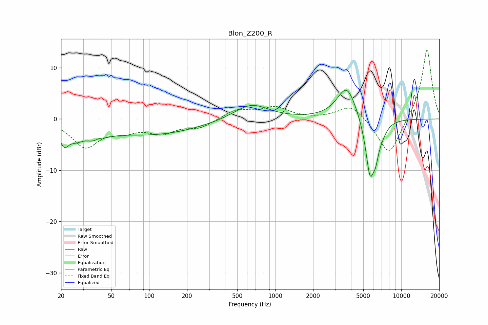

# Blon_Z200_R
See [usage instructions](https://github.com/jaakkopasanen/AutoEq#usage) for more options and info.

### Parametric EQs
Apply preamp of -5.7 dB when using parametric equalizer.

|   # | Type    |   Fc (Hz) |    Q |   Gain (dB) |
|-----|---------|-----------|------|-------------|
|   1 | Peaking |        21 | 3.79 |        -3.5 |
|   2 | Peaking |        26 | 2.38 |        -2   |
|   3 | Peaking |        38 | 1.96 |        -3.1 |
|   4 | Peaking |        40 | 3.27 |         1.5 |
|   5 | Peaking |       103 | 0.37 |        -3   |
|   6 | Peaking |       644 | 1.04 |         3.1 |
|   7 | Peaking |      3702 | 1.82 |         6.6 |
|   8 | Peaking |      5648 | 3.71 |       -11.1 |
|   9 | Peaking |      6255 | 5.97 |        -3.2 |
|  10 | Peaking |      6916 | 3.04 |        -1.9 |

### Fixed Band EQs
When using fixed band (also called graphic) equalizer, apply preamp of **-13.5 dB** (if available) and set gains manually with these parameters.

|   # | Type    |   Fc (Hz) |    Q |   Gain (dB) |
|-----|---------|-----------|------|-------------|
|   1 | Peaking |        31 | 1.41 |        -5.3 |
|   2 | Peaking |        62 | 1.41 |        -1.8 |
|   3 | Peaking |       125 | 1.41 |        -2.4 |
|   4 | Peaking |       250 | 1.41 |        -1.6 |
|   5 | Peaking |       500 | 1.41 |         1.8 |
|   6 | Peaking |      1000 | 1.41 |         2.1 |
|   7 | Peaking |      2000 | 1.41 |        -0   |
|   8 | Peaking |      4000 | 1.41 |         2.9 |
|   9 | Peaking |      8000 | 1.41 |        -7.5 |
|  10 | Peaking |     16000 | 1.41 |        13.9 |

### Graphs

