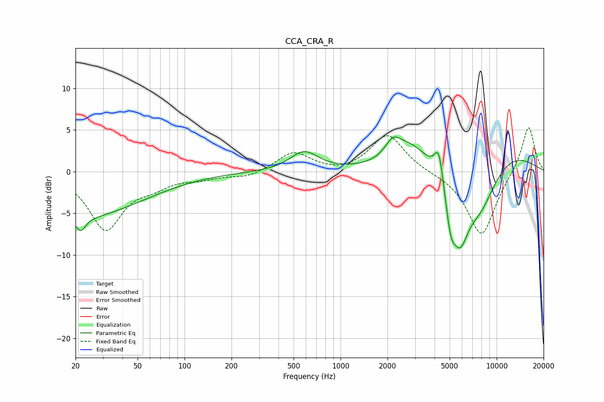

# CCA_CRA_R
See [usage instructions](https://github.com/jaakkopasanen/AutoEq#usage) for more options and info.

### Parametric EQs
Apply preamp of -4.2 dB when using parametric equalizer.

|   # | Type    |   Fc (Hz) |    Q |   Gain (dB) |
|-----|---------|-----------|------|-------------|
|   1 | Peaking |        20 | 0.33 |        -5.5 |
|   2 | Peaking |        22 | 4.79 |        -1.6 |
|   3 | Peaking |       584 | 1.57 |         2.3 |
|   4 | Peaking |      2164 | 2.87 |         2   |
|   5 | Peaking |      2808 | 1.18 |         3.1 |
|   6 | Peaking |      4261 | 4.93 |         3.8 |
|   7 | Peaking |      5075 | 4.15 |        -4.5 |
|   8 | Peaking |      5841 | 2.68 |        -5.9 |
|   9 | Peaking |      7659 | 0.9  |        -9.3 |
|  10 | Peaking |      9088 | 0.5  |         5.6 |

### Fixed Band EQs
When using fixed band (also called graphic) equalizer, apply preamp of **-5.4 dB** (if available) and set gains manually with these parameters.

|   # | Type    |   Fc (Hz) |    Q |   Gain (dB) |
|-----|---------|-----------|------|-------------|
|   1 | Peaking |        31 | 1.41 |        -6.8 |
|   2 | Peaking |        62 | 1.41 |        -1.3 |
|   3 | Peaking |       125 | 1.41 |        -0.7 |
|   4 | Peaking |       250 | 1.41 |        -0.7 |
|   5 | Peaking |       500 | 1.41 |         2.3 |
|   6 | Peaking |      1000 | 1.41 |        -0.3 |
|   7 | Peaking |      2000 | 1.41 |         4.5 |
|   8 | Peaking |      4000 | 1.41 |        -0.1 |
|   9 | Peaking |      8000 | 1.41 |        -7.8 |
|  10 | Peaking |     16000 | 1.41 |         5.7 |

### Graphs

