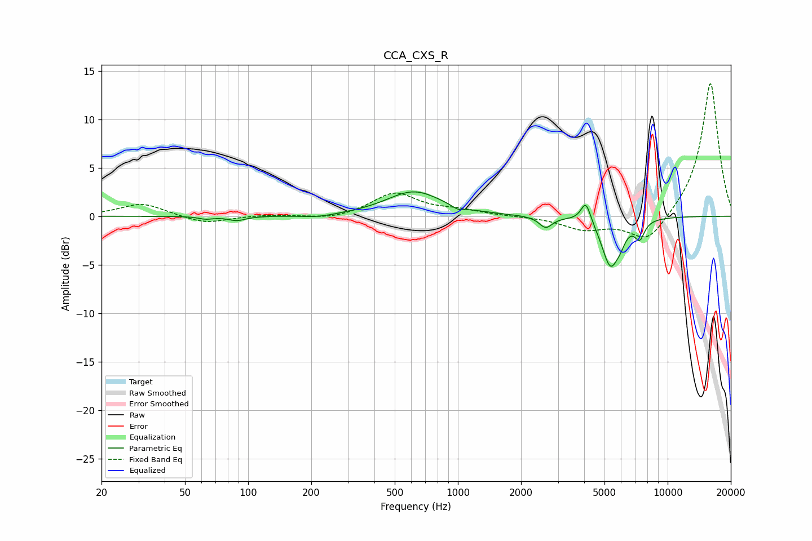

# CCA_CXS_R
See [usage instructions](https://github.com/jaakkopasanen/AutoEq#usage) for more options and info.

### Parametric EQs
Apply preamp of -2.6 dB when using parametric equalizer.

|   # | Type    |   Fc (Hz) |    Q |   Gain (dB) |
|-----|---------|-----------|------|-------------|
|   1 | Peaking |        63 | 4.34 |        -0.3 |
|   2 | Peaking |        88 | 3.38 |        -0.4 |
|   3 | Peaking |       215 | 1.74 |        -0.3 |
|   4 | Peaking |       617 | 1.08 |         2.5 |
|   5 | Peaking |       999 | 4.87 |        -0.4 |
|   6 | Peaking |      2623 | 4.56 |        -1.2 |
|   7 | Peaking |      4076 | 5.98 |         2.2 |
|   8 | Peaking |      5338 | 3.37 |        -5   |
|   9 | Peaking |      5968 | 6    |        -0.8 |
|  10 | Peaking |      7355 | 6    |        -1.8 |

### Fixed Band EQs
When using fixed band (also called graphic) equalizer, apply preamp of **-13.8 dB** (if available) and set gains manually with these parameters.

|   # | Type    |   Fc (Hz) |    Q |   Gain (dB) |
|-----|---------|-----------|------|-------------|
|   1 | Peaking |        31 | 1.41 |         1.3 |
|   2 | Peaking |        62 | 1.41 |        -0.8 |
|   3 | Peaking |       125 | 1.41 |         0.2 |
|   4 | Peaking |       250 | 1.41 |        -0.4 |
|   5 | Peaking |       500 | 1.41 |         2.4 |
|   6 | Peaking |      1000 | 1.41 |         0.5 |
|   7 | Peaking |      2000 | 1.41 |        -0   |
|   8 | Peaking |      4000 | 1.41 |        -1.3 |
|   9 | Peaking |      8000 | 1.41 |        -2.9 |
|  10 | Peaking |     16000 | 1.41 |        13.9 |

### Graphs

