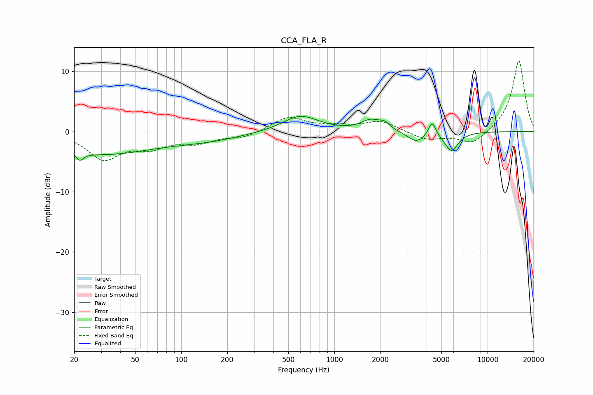

# CCA_FLA_R
See [usage instructions](https://github.com/jaakkopasanen/AutoEq#usage) for more options and info.

### Parametric EQs
Apply preamp of -2.6 dB when using parametric equalizer.

|   # | Type    |   Fc (Hz) |    Q |   Gain (dB) |
|-----|---------|-----------|------|-------------|
|   1 | Peaking |        22 | 5.97 |        -4.5 |
|   2 | Peaking |        22 | 6    |         3.2 |
|   3 | Peaking |        30 | 0.41 |        -3.6 |
|   4 | Peaking |       145 | 0.59 |        -1.2 |
|   5 | Peaking |       601 | 1.21 |         2.7 |
|   6 | Peaking |      1727 | 2.32 |         1.7 |
|   7 | Peaking |      2124 | 4.25 |         1   |
|   8 | Peaking |      3437 | 2.5  |        -1.7 |
|   9 | Peaking |      4340 | 6    |         2.5 |
|  10 | Peaking |      5812 | 3.16 |        -3.2 |

### Fixed Band EQs
When using fixed band (also called graphic) equalizer, apply preamp of **-11.8 dB** (if available) and set gains manually with these parameters.

|   # | Type    |   Fc (Hz) |    Q |   Gain (dB) |
|-----|---------|-----------|------|-------------|
|   1 | Peaking |        31 | 1.41 |        -4.4 |
|   2 | Peaking |        62 | 1.41 |        -2.2 |
|   3 | Peaking |       125 | 1.41 |        -1.6 |
|   4 | Peaking |       250 | 1.41 |        -1   |
|   5 | Peaking |       500 | 1.41 |         2.4 |
|   6 | Peaking |      1000 | 1.41 |         0.7 |
|   7 | Peaking |      2000 | 1.41 |         1.7 |
|   8 | Peaking |      4000 | 1.41 |        -1.4 |
|   9 | Peaking |      8000 | 1.41 |        -2.3 |
|  10 | Peaking |     16000 | 1.41 |        11.9 |

### Graphs

