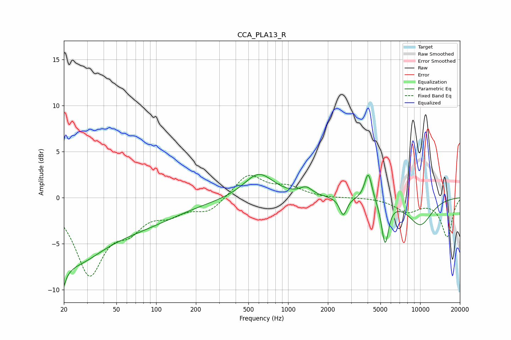

# CCA_PLA13_R
See [usage instructions](https://github.com/jaakkopasanen/AutoEq#usage) for more options and info.

### Parametric EQs
Apply preamp of -2.6 dB when using parametric equalizer.

|   # | Type    |   Fc (Hz) |    Q |   Gain (dB) |
|-----|---------|-----------|------|-------------|
|   1 | Peaking |        20 | 4.72 |        -6.8 |
|   2 | Peaking |        20 | 5.58 |         3.4 |
|   3 | Peaking |        24 | 0.67 |        -5.6 |
|   4 | Peaking |        71 | 0.43 |        -2.5 |
|   5 | Peaking |       598 | 1.28 |         2.7 |
|   6 | Peaking |      1369 | 3.04 |         0.8 |
|   7 | Peaking |      2615 | 5.22 |        -2   |
|   8 | Peaking |      4048 | 5.06 |         3.1 |
|   9 | Peaking |      5422 | 5.25 |        -4.7 |
|  10 | Peaking |     10000 | 1.31 |        -2.9 |

### Fixed Band EQs
When using fixed band (also called graphic) equalizer, apply preamp of **-2.5 dB** (if available) and set gains manually with these parameters.

|   # | Type    |   Fc (Hz) |    Q |   Gain (dB) |
|-----|---------|-----------|------|-------------|
|   1 | Peaking |        31 | 1.41 |        -8   |
|   2 | Peaking |        62 | 1.41 |        -2.6 |
|   3 | Peaking |       125 | 1.41 |        -1.4 |
|   4 | Peaking |       250 | 1.41 |        -1.5 |
|   5 | Peaking |       500 | 1.41 |         2.6 |
|   6 | Peaking |      1000 | 1.41 |         1   |
|   7 | Peaking |      2000 | 1.41 |        -0.1 |
|   8 | Peaking |      4000 | 1.41 |         0   |
|   9 | Peaking |      8000 | 1.41 |        -1.4 |
|  10 | Peaking |     16000 | 1.41 |        -4.2 |

### Graphs

