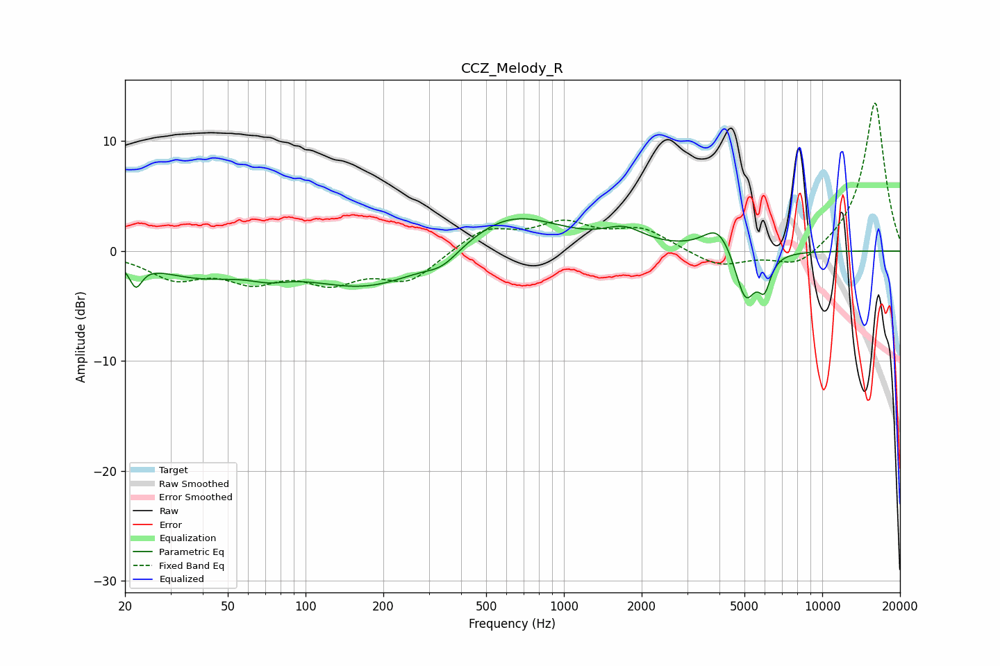

# CCZ_Melody_R
See [usage instructions](https://github.com/jaakkopasanen/AutoEq#usage) for more options and info.

### Parametric EQs
Apply preamp of -3.0 dB when using parametric equalizer.

|   # | Type    |   Fc (Hz) |    Q |   Gain (dB) |
|-----|---------|-----------|------|-------------|
|   1 | Peaking |        22 | 5.91 |        -2.1 |
|   2 | Peaking |        38 | 0.8  |        -1.9 |
|   3 | Peaking |        72 | 1.88 |        -0.7 |
|   4 | Peaking |       177 | 0.6  |        -3.4 |
|   5 | Peaking |       339 | 2.12 |        -1.2 |
|   6 | Peaking |       618 | 0.74 |         3.6 |
|   7 | Peaking |      1714 | 1.85 |         1.4 |
|   8 | Peaking |      3955 | 2.48 |         2.4 |
|   9 | Peaking |      5045 | 3.51 |        -4.8 |
|  10 | Peaking |      5979 | 6    |        -2.6 |

### Fixed Band EQs
When using fixed band (also called graphic) equalizer, apply preamp of **-13.6 dB** (if available) and set gains manually with these parameters.

|   # | Type    |   Fc (Hz) |    Q |   Gain (dB) |
|-----|---------|-----------|------|-------------|
|   1 | Peaking |        31 | 1.41 |        -2.3 |
|   2 | Peaking |        62 | 1.41 |        -2.3 |
|   3 | Peaking |       125 | 1.41 |        -2.4 |
|   4 | Peaking |       250 | 1.41 |        -2.6 |
|   5 | Peaking |       500 | 1.41 |         2   |
|   6 | Peaking |      1000 | 1.41 |         2.3 |
|   7 | Peaking |      2000 | 1.41 |         1.9 |
|   8 | Peaking |      4000 | 1.41 |        -1.5 |
|   9 | Peaking |      8000 | 1.41 |        -1.7 |
|  10 | Peaking |     16000 | 1.41 |        13.7 |

### Graphs

