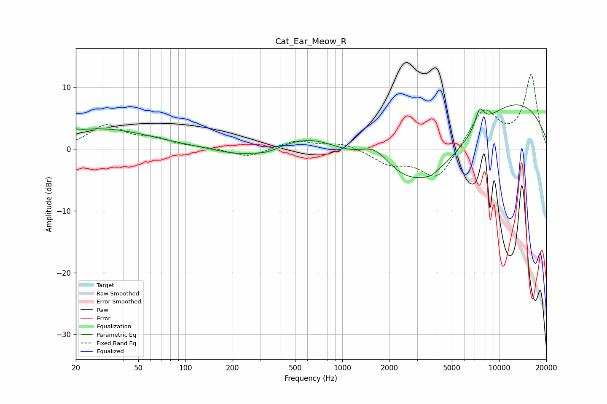

# Cat_Ear_Meow_R
See [usage instructions](https://github.com/jaakkopasanen/AutoEq#usage) for more options and info.

### Parametric EQs
Apply preamp of -7.2 dB when using parametric equalizer.

|   # | Type    |   Fc (Hz) |    Q |   Gain (dB) |
|-----|---------|-----------|------|-------------|
|   1 | Peaking |        20 | 5.5  |         0.3 |
|   2 | Peaking |        29 | 0.44 |         3.2 |
|   3 | Peaking |       219 | 0.91 |        -1.2 |
|   4 | Peaking |       334 | 1.75 |        -0.8 |
|   5 | Peaking |       669 | 0.67 |         3.3 |
|   6 | Peaking |      1618 | 1.31 |         4.2 |
|   7 | Peaking |      3254 | 0.38 |       -10.6 |
|   8 | Peaking |      3666 | 4    |        -0.4 |
|   9 | Peaking |      7515 | 4.57 |         3.1 |
|  10 | Peaking |     10000 | 0.3  |        10   |

### Fixed Band EQs
When using fixed band (also called graphic) equalizer, apply preamp of **-12.1 dB** (if available) and set gains manually with these parameters.

|   # | Type    |   Fc (Hz) |    Q |   Gain (dB) |
|-----|---------|-----------|------|-------------|
|   1 | Peaking |        31 | 1.41 |         3.7 |
|   2 | Peaking |        62 | 1.41 |         1.4 |
|   3 | Peaking |       125 | 1.41 |         0.2 |
|   4 | Peaking |       250 | 1.41 |        -1.4 |
|   5 | Peaking |       500 | 1.41 |         1.4 |
|   6 | Peaking |      1000 | 1.41 |         1   |
|   7 | Peaking |      2000 | 1.41 |        -2.2 |
|   8 | Peaking |      4000 | 1.41 |        -5.1 |
|   9 | Peaking |      8000 | 1.41 |         6.3 |
|  10 | Peaking |     16000 | 1.41 |        11.8 |

### Graphs

