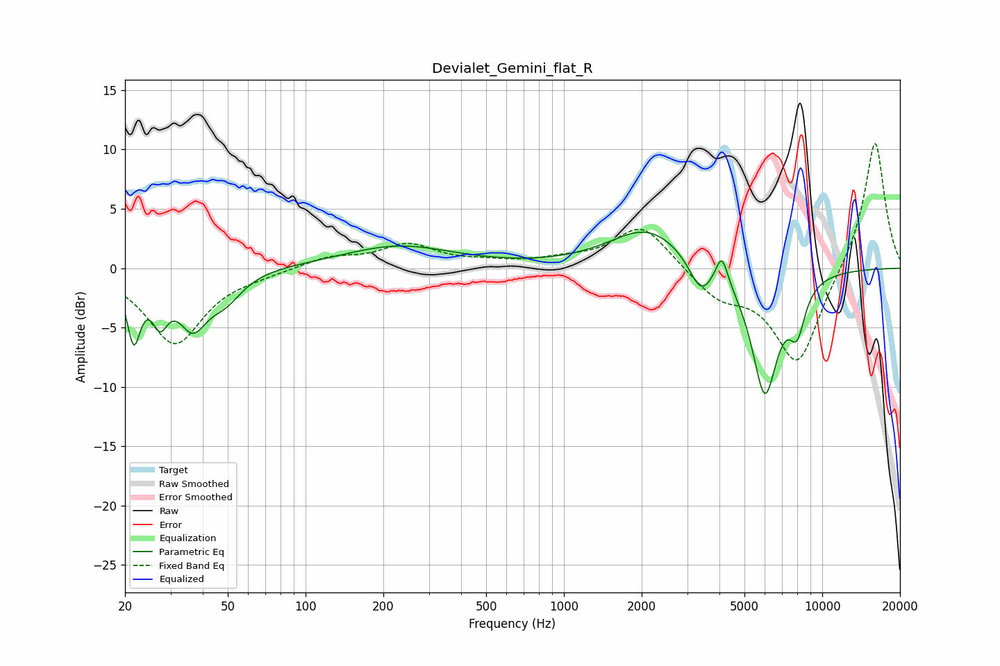

# Devialet_Gemini_flat_R
See [usage instructions](https://github.com/jaakkopasanen/AutoEq#usage) for more options and info.

### Parametric EQs
Apply preamp of -3.1 dB when using parametric equalizer.

|   # | Type    |   Fc (Hz) |    Q |   Gain (dB) |
|-----|---------|-----------|------|-------------|
|   1 | Peaking |        22 | 5.51 |        -5.4 |
|   2 | Peaking |        27 | 4.66 |        -3.1 |
|   3 | Peaking |        37 | 2.52 |        -4.3 |
|   4 | Peaking |        49 | 2.12 |        -2.1 |
|   5 | Peaking |       229 | 0.66 |         1.9 |
|   6 | Peaking |      2119 | 0.95 |         3.4 |
|   7 | Peaking |      3385 | 3.17 |        -2.7 |
|   8 | Peaking |      4086 | 6    |         2.5 |
|   9 | Peaking |      5995 | 2.6  |       -10.6 |
|  10 | Peaking |      7996 | 4.21 |        -3.6 |

### Fixed Band EQs
When using fixed band (also called graphic) equalizer, apply preamp of **-10.6 dB** (if available) and set gains manually with these parameters.

|   # | Type    |   Fc (Hz) |    Q |   Gain (dB) |
|-----|---------|-----------|------|-------------|
|   1 | Peaking |        31 | 1.41 |        -6.4 |
|   2 | Peaking |        62 | 1.41 |        -0.3 |
|   3 | Peaking |       125 | 1.41 |         0.9 |
|   4 | Peaking |       250 | 1.41 |         1.9 |
|   5 | Peaking |       500 | 1.41 |         0.4 |
|   6 | Peaking |      1000 | 1.41 |         0.5 |
|   7 | Peaking |      2000 | 1.41 |         3.7 |
|   8 | Peaking |      4000 | 1.41 |        -2.3 |
|   9 | Peaking |      8000 | 1.41 |        -8.2 |
|  10 | Peaking |     16000 | 1.41 |        11   |

### Graphs

