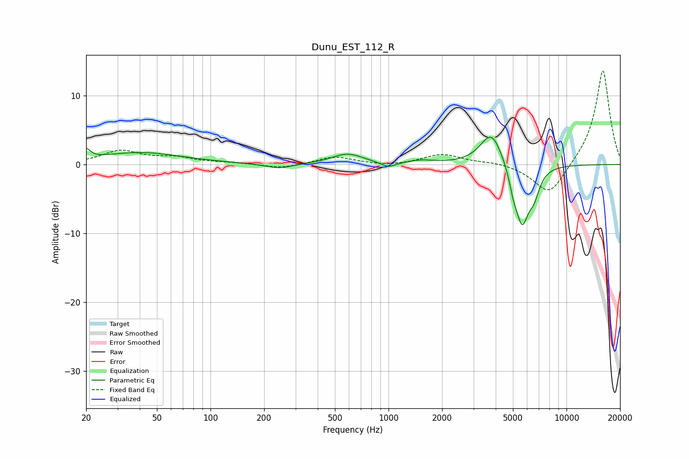

# Dunu_EST_112_R
See [usage instructions](https://github.com/jaakkopasanen/AutoEq#usage) for more options and info.

### Parametric EQs
Apply preamp of -4.1 dB when using parametric equalizer.

|   # | Type    |   Fc (Hz) |    Q |   Gain (dB) |
|-----|---------|-----------|------|-------------|
|   1 | Peaking |        20 | 5.99 |         1.4 |
|   2 | Peaking |        40 | 0.6  |         1.7 |
|   3 | Peaking |       243 | 1.9  |        -0.7 |
|   4 | Peaking |       588 | 1.61 |         1.5 |
|   5 | Peaking |       997 | 3.42 |        -0.8 |
|   6 | Peaking |      1530 | 1.91 |         0.5 |
|   7 | Peaking |      3789 | 2.25 |         5   |
|   8 | Peaking |      5033 | 5.96 |        -2   |
|   9 | Peaking |      5631 | 3.56 |        -8.3 |
|  10 | Peaking |      6563 | 4.3  |        -2.9 |

### Fixed Band EQs
When using fixed band (also called graphic) equalizer, apply preamp of **-13.7 dB** (if available) and set gains manually with these parameters.

|   # | Type    |   Fc (Hz) |    Q |   Gain (dB) |
|-----|---------|-----------|------|-------------|
|   1 | Peaking |        31 | 1.41 |         1.9 |
|   2 | Peaking |        62 | 1.41 |         0.9 |
|   3 | Peaking |       125 | 1.41 |         0.2 |
|   4 | Peaking |       250 | 1.41 |        -0.6 |
|   5 | Peaking |       500 | 1.41 |         1.1 |
|   6 | Peaking |      1000 | 1.41 |        -0.3 |
|   7 | Peaking |      2000 | 1.41 |         1.5 |
|   8 | Peaking |      4000 | 1.41 |         0.3 |
|   9 | Peaking |      8000 | 1.41 |        -4.7 |
|  10 | Peaking |     16000 | 1.41 |        13.9 |

### Graphs

